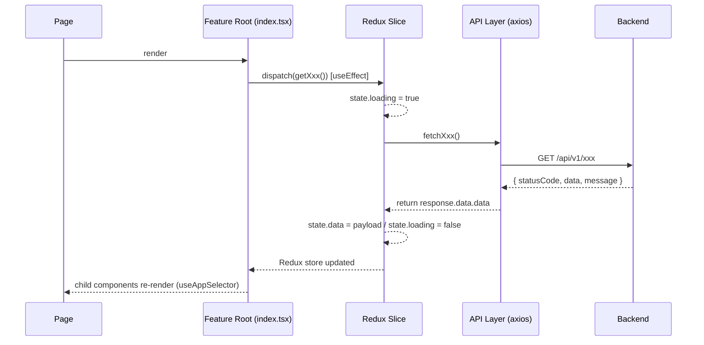
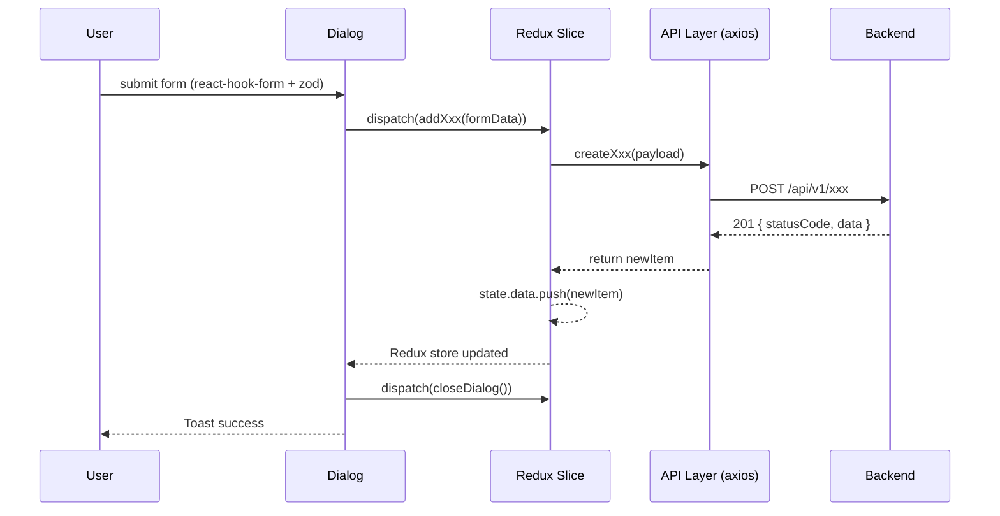
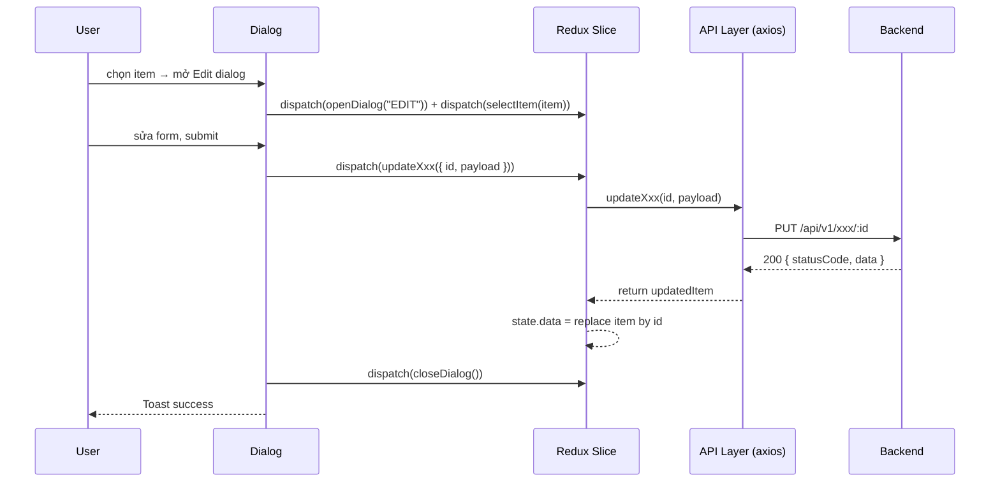
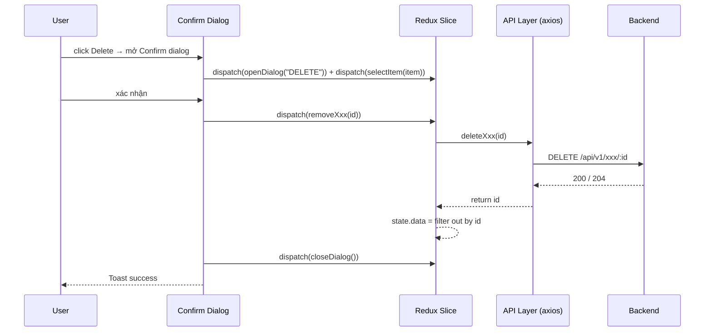

# ARCHITECTURE.md — Kiến trúc dự án

> **HCMUS WiFi Management — Admin Portal**  
> React 19 · TypeScript · Vite · Redux Toolkit · TailwindCSS v4

---

## Cấu trúc thư mục

```
admin/
├── src/
│   ├── App.tsx                      # Router root, auth guard, layout wrapper
│   ├── main.tsx                     # Bootstrap: axios init → Redux Provider → App
│   ├── index.css                    # Global styles, CSS variables
│   │
│   ├── components/                  # Shared UI dùng chung toàn app
│   │   ├── DashboardLayout.tsx      # App shell: sidebar + header
│   │   ├── ErrorBoundary.tsx        # Global error boundary
│   │   └── ui/                      # Radix-based primitives (button, dialog, table...)
│   │
│   ├── config/
│   │   ├── api.ts                   # API_BASE_URL
│   │   └── axios.ts                 # Axios instance: timeout, auth interceptor
│   │
│   ├── constants/
│   │   └── appKeys.ts               # STORAGE_KEYS, HTTP_CONFIG, API_HEADERS
│   │
│   ├── contexts/
│   │   └── ThemeContext.tsx         # Light/Dark theme context
│   │
│   ├── data/                        # Mock data (dùng khi API chưa có)
│   │
│   ├── features/                    # ★ Trung tâm kiến trúc — mỗi domain là 1 folder
│   │   │
│   │   ├── access-points/
│   │   │   ├── index.tsx            # Feature root component
│   │   │   ├── api/
│   │   │   │   └── accessPointsApi.ts
│   │   │   ├── slices/
│   │   │   │   └── accessPointsSlice.ts
│   │   │   ├── components/
│   │   │   │   ├── APsTable.tsx
│   │   │   │   ├── ControllersTable.tsx
│   │   │   │   ├── AccessPointsHeader.tsx
│   │   │   │   ├── AccessPointsMap.tsx
│   │   │   │   └── OverloadedAPsTable.tsx
│   │   │   └── types/
│   │   │       └── index.ts         # AP, Controller interfaces
│   │   │
│   │   ├── auth/
│   │   ├── dashboard/
│   │   ├── policies/
│   │   ├── reports/
│   │   ├── settings/
│   │   └── users/
│   │
│   ├── hooks/                       # Custom hooks dùng chung (useDebounce, ...)
│   ├── lib/                         # Utility functions (cn, formatters, ...)
│   │
│   ├── pages/                       # Route-level wrappers (chỉ import và render Feature)
│   │   ├── AccessPoints.tsx
│   │   ├── Dashboard.tsx
│   │   ├── Login.tsx
│   │   ├── Policies.tsx
│   │   ├── Reports.tsx
│   │   ├── Settings.tsx
│   │   └── Users.tsx
│   │
│   ├── services/                    # Cross-feature services
│   │
│   ├── stores/
│   │   ├── store.ts                 # Root Redux store
│   │   └── hooks.ts                 # useAppDispatch, useAppSelector (typed)
│   │
│   └── types/                       # Types dùng chung toàn app
├── vite.config.ts
├── tsconfig.json
└── package.json
```

---

## Cấu trúc chuẩn của một Feature

```
features/<ten-feature>/
├── index.tsx            # Feature root: load data, mount dialogs, tổ chức layout
├── api/
│   └── <ten>Api.ts      # Hàm gọi HTTP (axios thuần, không có state)
├── slices/
│   └── <ten>Slice.ts    # Redux slice: state, reducers, async thunks
├── components/
│   ├── <Ten>Table.tsx
│   ├── <Ten>Header.tsx
│   └── dialogs/
│       └── <Ten>Dialog.tsx
└── types/
    └── index.ts         # TypeScript interfaces cho feature này
```

---

## Redux Store

```
store.ts
  ├── users          → features/users/slices/usersSlice.ts
  ├── accessPoints   → features/access-points/slices/accessPointsSlice.ts
  ├── settings       → features/settings/slices/index.ts (combineReducers × 6)
  │     ├── admin, security, areas, devices, integrations, logs
  ├── reports        → features/reports/slices/index.ts
  ├── policies       → features/policies/slices/index.ts
  ├── auth           → features/auth/slices/authSlice.ts
  └── dashboard      → features/dashboard/slices/dashboardSlice.ts
```

---

## Route Map

| Path | Page | Feature |
|---|---|---|
| `/login` | `Login.tsx` | auth |
| `/` | `Dashboard.tsx` | dashboard |
| `/users` | `Users.tsx` | users |
| `/access-points` | `AccessPoints.tsx` | access-points |
| `/policies` | `Policies.tsx` | policies |
| `/reports` | `Reports.tsx` | reports |
| `/settings` | `Settings.tsx` | settings |

---

## Trạng thái tích hợp API

| Feature | Trạng thái |
|---|---|
| `access-points` (APs & Controllers) | ✅ Live |
| `settings/areas` (Campus, Building, Location) | ✅ Live |
| `settings/devices` (AP & Controller forms) | ✅ Live |
| `users` | 🔶 Mock |
| `reports` | 🔶 Mock |
| `policies` | 🔶 Mock |
| `settings/admin`, `security`, `integrations`, `logs` | 🔶 Mock |
| `auth` | ⚠️ Stub (hardcode) |

---

## Sequence — Luồng gọi API

### 1. Fetch dữ liệu (GET)



---

### 2. Tạo mới (POST)



---

### 3. Cập nhật (PUT)



---

### 4. Xóa (DELETE)


