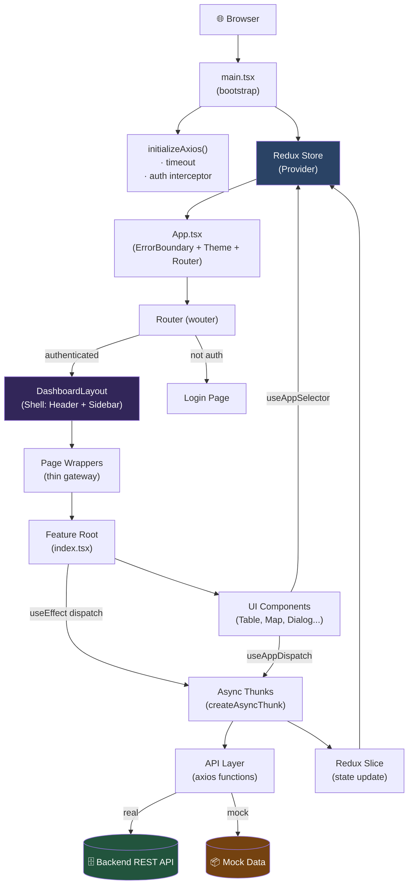

# ARCHITECTURE.md — Tài liệu kiến trúc dự án

> **Hcmus WiFi Management — Admin Portal**  
> React 19 · TypeScript · Vite · Redux Toolkit · TailwindCSS

---

## Mục lục

1. [Tổng quan hệ thống](#1-tổng-quan-hệ-thống)
2. [Công nghệ và vai trò từng thành phần](#2-công-nghệ-và-vai-trò-từng-thành-phần)
3. [Cấu trúc thư mục](#3-cấu-trúc-thư-mục)
4. [Luồng khởi động ứng dụng](#4-luồng-khởi-động-ứng-dụng)
5. [Kiến trúc Routing](#5-kiến-trúc-routing)
6. [Kiến trúc State Management (Redux)](#6-kiến-trúc-state-management-redux)
7. [Tầng dữ liệu (API Layer)](#7-tầng-dữ-liệu-api-layer)
8. [Kiến trúc UI Composition](#8-kiến-trúc-ui-composition)
9. [Luồng dữ liệu end-to-end (ví dụ Access Points)](#9-luồng-dữ-liệu-end-to-end)
10. [Error Handling & Reliability](#10-error-handling--reliability)
11. [Security & Authentication](#11-security--authentication)
12. [Sơ đồ kiến trúc tổng thể](#12-sơ-đồ-kiến-trúc-tổng-thể)
13. [Hướng dẫn tạo Feature mới](#13-hướng-dẫn-tạo-feature-mới)
14. [Nợ kỹ thuật & Ưu tiên cải thiện](#14-nợ-kỹ-thuật--ưu-tiên-cải-thiện)

---

## 1. Tổng quan hệ thống

Dự án là **giao diện quản trị web (Admin SPA)** cho hệ thống quản lý truy cập WiFi tại trường HCMUS.

**Kiến trúc hiện tại:** Feature-First + Redux Toolkit

| Thuộc tính | Mô tả |
|---|---|
| Mô hình | Single Page Application (SPA) |
| Routing | Client-side (wouter) |
| State | Redux Toolkit — centralized store |
| Build tool | Vite |
| Tầng UI | React 19 + TypeScript + TailwindCSS |
| HTTP Client | Axios (cấu hình tập trung) |

**Mục tiêu kiến trúc:**
- Cho phép từng team sở hữu và phát triển độc lập theo từng **feature/domain**.
- App shell và routing tập trung, các feature phát triển theo chiều dọc (end-to-end từ API → Slice → Component).


---

## 2. Công nghệ và vai trò từng thành phần

### 2.1 Runtime & Build

| Thư viện | Phiên bản | Vai trò |
|---|---|---|
| **Vite** | 6.x | Dev server, HMR, bundling, preview |
| **React** | 19.x | UI rendering, component model |
| **TypeScript** | 5.x | Type safety toàn bộ codebase |

### 2.2 State & Data

| Thư viện | Vai trò |
|---|---|
| **Redux Toolkit** | State management tập trung, `createSlice` + `createAsyncThunk` |
| **react-redux** | Kết nối React với Redux; hooks typed: `useAppDispatch`, `useAppSelector` |
| **Axios** | HTTP client, đã cấu hình global (timeout, headers, interceptor) |

### 2.3 Routing & Shell

| Thư viện | Vai trò |
|---|---|
| **wouter** | Router nhẹ cho SPA, thay thế React Router |
| **DashboardLayout** | App shell: header, sidebar, user menu, routing menu |

### 2.4 UI & Utilities

| Thư viện | Vai trò |
|---|---|
| **TailwindCSS** | Utility-first CSS framework |
| **Radix UI** | Headless UI primitives (dialog, tooltip, tabs, dropdown...) |
| **lucide-react** | Icon set |
| **recharts** | Biểu đồ |
| **sonner** | Toast notifications |

---

## 3. Cấu trúc thư mục

```
admin/
├── src/
│   ├── App.tsx                  # Router root, auth guard, layout wrapper
│   ├── main.tsx                 # Bootstrap: axios init → Redux Provider → App
│   ├── index.css                # Global styles, CSS variables
│   │
│   ├── components/              # Shared UI components (reusable across features)
│   │   ├── DashboardLayout.tsx  # App shell: sidebar + header
│   │   ├── ErrorBoundary.tsx    # Global error boundary
│   │   └── ui/                  # Radix-based primitives (button, dialog, table...)
│   │
│   ├── config/
│   │   ├── api.ts               # API_BASE_URL
│   │   └── axios.ts             # Axios instance: timeout, headers, interceptors
│   │
│   ├── constants/
│   │   └── appKeys.ts           # STORAGE_KEYS, HTTP_CONFIG, API_HEADERS
│   │
│   ├── contexts/
│   │   └── ThemeContext.tsx     # Light/Dark theme context
│   │
│   ├── data/                    # Mock data trung tâm (dùng khi chưa có API)
│   │
│   ├── features/                # ★ TRUNG TÂM KIẾN TRÚC — mỗi domain là 1 folder
│   │   ├── access-points/
│   │   ├── auth/
│   │   ├── dashboard/
│   │   ├── policies/
│   │   ├── reports/
│   │   ├── settings/
│   │   └── users/
│   │
│   ├── hooks/                   # Custom hooks dùng chung (useDebounce, ...)
│   ├── lib/                     # Utility functions (cn, formatters, ...)
│   │
│   ├── pages/                   # Route-level wrappers (gateway mỏng)
│   │   ├── AccessPoints.tsx
│   │   ├── Dashboard.tsx
│   │   ├── Login.tsx
│   │   ├── Policies.tsx
│   │   ├── Reports.tsx
│   │   ├── Settings.tsx
│   │   └── Users.tsx
│   │
│   ├── services/                # Cross-feature service layer
│   ├── stores/
│   │   ├── store.ts             # Root Redux store, combineReducers
│   │   └── hooks.ts             # useAppDispatch, useAppSelector (typed)
│   │
│   └── types/                   # Type chung toàn app (nếu có)
│
├── ARCHITECTURE.md              # Tài liệu này
├── v1.md                        # API contract với backend
├── vite.config.ts
├── tsconfig.json
└── package.json
```

### Cấu trúc bên trong một Feature

Mỗi feature trong `src/features/<ten-feature>/` theo chuẩn sau:

```
features/<ten-feature>/
├── index.tsx            # ★ Feature root component (entry point)
├── api/
│   └── <ten>Api.ts      # Tầng gọi HTTP (axios), hàm thuần, không có state
├── slices/
│   └── <ten>Slice.ts    # Redux slice: state, reducers, async thunks
├── components/          # UI components nội bộ của feature
│   ├── <Ten>Table.tsx
│   ├── <Ten>Header.tsx
│   └── dialogs/
│       └── <Ten>Dialog.tsx
├── types/
│   └── index.ts         # TypeScript interfaces & types cho feature này
└── constants/           # (tùy chọn) Constants, enum mapping
    └── index.ts
```

> **Nguyên tắc:** Page chỉ là gateway — nó import và render Feature root. Toàn bộ logic nằm trong feature.

---

## 4. Luồng khởi động ứng dụng

```
main.tsx
  │
  ├─ 1. initializeAxios()           → Cấu hình global: timeout, headers, auth interceptor
  │
  └─ 2. render(<Provider store={store}>
                 <App />
               </Provider>)
                 │
                 └─ App.tsx
                      ├─ <ErrorBoundary>       → Bắt toàn bộ lỗi runtime
                      ├─ <ThemeProvider>       → Context light/dark
                      ├─ <TooltipProvider>
                      ├─ <Toaster />           → Toast notifications global
                      └─ <Router>              → Xem mục 5
```

**Ý nghĩa thiết kế:**
- Axios sẵn sàng tự động gắn `Authorization` header cho mọi request ngay từ đầu.
- Redux store sẵn sàng cho tất cả feature.
- ErrorBoundary bảo vệ userr khỏi màn hình trắng khi có lỗi runtime.

---

## 5. Kiến trúc Routing

### 5.1 Route map

| Path | Page Component | Feature Rendered |
|---|---|---|
| `/login` | `Login.tsx` | Auth feature |
| `/` | `Dashboard.tsx` | DashboardFeature |
| `/users` | `Users.tsx` | UsersFeature |
| `/access-points` | `AccessPoints.tsx` | AccessPointsFeature |
| `/policies` | `Policies.tsx` | PoliciesFeature |
| `/reports` | `Reports.tsx` | ReportsFeature |
| `/settings` | `Settings.tsx` | SettingsFeature |

### 5.2 Cấu trúc Router (App.tsx)

```
Router (wouter)
  ├── /login  → <Login />
  └── * (authenticated?)
        ├── YES → <DashboardLayout>
        │           └── <Switch>  ← nested routes
        │                 ├── /        → <Dashboard />
        │                 ├── /users   → <Users />
        │                 └── ...
        └── NO  → <Redirect to="/login" />
```

### 5.3 Lưu ý về Auth Guard

> ⚠️ **Hiện tại:** `isAuthenticated()` trong `App.tsx` đang **hardcode trả về `'true'`** — tức là mọi route đều cho vào mà không kiểm tra.
>
> **Cần làm:** Thay bằng `localStorage.getItem('isLoggedIn') === 'true'` và kết nối với `authSlice`.

---

## 6. Kiến trúc State Management (Redux)

### 6.1 Root Store

```typescript
// src/stores/store.ts
configureStore({
  reducer: {
    users,          // src/features/users/slices/usersSlice.ts
    accessPoints,   // src/features/access-points/slices/accessPointsSlice.ts
    settings,       // src/features/settings/slices/index.ts (combineReducers)
    reports,        // src/features/reports/slices/index.ts (combineReducers)
    policies,       // src/features/policies/slices/index.ts (combineReducers)
    auth,           // src/features/auth/slices/authSlice.ts
    dashboard,      // src/features/dashboard/slices/dashboardSlice.ts
  }
})
```

### 6.2 Pattern chuẩn cho một Slice

Mỗi feature slice theo cấu trúc:

```typescript
// Ví dụ: accessPointsSlice.ts

// 1. Async Thunks (gọi API)
export const getAPs = createAsyncThunk('accessPoints/fetchAPs', async () => {
  return await fetchAPs(); // gọi hàm trong api/accessPointsApi.ts
});

// 2. Interface State
interface AccessPointsState {
  data: AP[];
  loading: boolean;
  error: string | null;
  // UI state (filters, toggles...)
  searchTerm: string;
}

// 3. Initial State
const initialState: AccessPointsState = { ... };

// 4. Slice
const slice = createSlice({
  name: 'accessPoints',
  initialState,
  reducers: {
    // Synchronous UI actions
    setSearchTerm: (state, action: PayloadAction<string>) => { ... }
  },
  extraReducers: (builder) => {
    // Xử lý pending / fulfilled / rejected cho mỗi thunk
    builder
      .addCase(getAPs.pending,    (state) => { state.loading = true; })
      .addCase(getAPs.fulfilled,  (state, action) => { state.data = action.payload; })
      .addCase(getAPs.rejected,   (state, action) => { state.error = action.error.message; });
  }
});
```

### 6.3 Composite Reducers (settings, reports, policies)

Các feature lớn dùng `combineReducers` để chia nhỏ:

```
settings  ← combineReducers(admin, security, areas, devices, integrations, logs)
reports   ← combineReducers(filters, usersReport, bandwidthReport, ...)
policies  ← combineReducers(policies, authPolicies)
```

**Lợi ích:** Mỗi sub-domain độc lập, team khác nhau có thể sở hữu từng slice.

### 6.4 Typed Hooks

```typescript
// src/stores/hooks.ts — LUÔN dùng những hooks này thay cho useDispatch gốc
export const useAppDispatch = () => useDispatch<AppDispatch>();
export const useAppSelector: TypedUseSelectorHook<RootState> = useSelector;
```

---

## 7. Tầng dữ liệu (API Layer)

### 7.1 Cấu hình Axios toàn cục

```typescript
// src/config/axios.ts
initializeAxios() {
  axios.defaults.timeout = HTTP_CONFIG.TIMEOUT;
  axios.defaults.headers.common['Content-Type'] = API_HEADERS.CONTENT_TYPE;

  // Request interceptor: tự động gắn Authorization header
  axios.interceptors.request.use((config) => {
    const token = localStorage.getItem(STORAGE_KEYS.ACCESS_TOKEN);
    if (token) config.headers.Authorization = `Bearer ${token}`;
    return config;
  });
}
```

### 7.2 Cấu trúc một API file

```typescript
// src/features/<ten>/api/<ten>Api.ts
import axios from 'axios';
import { API_BASE_URL } from '@/config/api';
import { MyEntity } from '../types';

interface ApiResponse<T> {
  statusCode: number;
  data: T;
  message: string;
}

// Hàm thuần — không có state, không có Redux
export const fetchEntities = async (): Promise<MyEntity[]> => {
  const response = await axios.get<ApiResponse<MyEntity[]>>(`${API_BASE_URL}/my-endpoint`);
  return response.data.data;
};
```

### 7.3 Trạng thái tích hợp backend hiện tại

| Feature | API Source | Trạng thái |
|---|---|---|
| `access-points` | Backend thật (axios) | ✅ Live |
| `settings/areas` | Backend thật (axios) | ✅ Live |
| `settings/devices` | Backend thật (axios) | ✅ Live |
| `users` | Mock data (Promise.resolve) | 🔶 Hybrid |
| `reports` | Mock data | 🔶 Mock |
| `settings/admin` | Mock data | 🔶 Mock |
| `settings/integrations` | Mock data | 🔶 Mock |
| `settings/logs` | Mock data | 🔶 Mock |
| `policies` | Mock data | 🔶 Mock |
| `auth` | Mock (hardcode) | ⚠️ Stub |

---

## 8. Kiến trúc UI Composition

### 8.1 App Shell

```
DashboardLayout
  ├── Header (user dropdown, theme toggle, notifications)
  ├── Sidebar (menuItems → route list, submenu qua query string)
  └── <main> → {children} (feature page được render vào đây)
```

### 8.2 Pattern Feature Root Component

Feature root component (`index.tsx`) chịu trách nhiệm:

1. **Load dữ liệu** ban đầu trong `useEffect` bằng cách dispatch thunks.
2. **Mount toàn bộ Dialogs** một lần duy nhất (dialog mở/đóng qua Redux state).
3. **Tổ chức layout** bằng cách kết hợp các child components.

```tsx
// Ví dụ pattern: UsersFeature (index.tsx)
export function UsersFeature() {
  const dispatch = useAppDispatch();

  useEffect(() => {
    dispatch(getUsers());
    dispatch(getPolicies());
  }, [dispatch]);

  return (
    <div>
      <UsersHeader />
      <UsersFilters />
      <UsersTable />

      {/* Dialogs được mount 1 lần, điều khiển bằng Redux */}
      <AddUserDialog />
      <EditUserDialog />
      <DeleteUserDialog />
      <ViewUserDialog />
    </div>
  );
}
```

### 8.3 Pattern Dialog

Dialogs không truyền `isOpen` qua props — chúng đọc trực tiếp từ Redux:

```tsx
// Dialog component tự đọc state từ store
function AddUserDialog() {
  const { openDialogKey } = useAppSelector(state => state.users);
  const isOpen = openDialogKey === USER_DIALOG_KEYS.ADD;
  // ...
}
```

---

## 9. Luồng dữ liệu end-to-end

Ví dụ với feature **Access Points**:

```
User vào /access-points
        │
        ▼
  pages/AccessPoints.tsx         (gateway mỏng, chỉ render feature)
        │
        ▼
  features/access-points/index.tsx   (Feature Root)
        │
        ├── useEffect → dispatch(getAPs())
        │                   │
        │                   ▼
        │           slices/accessPointsSlice.ts
        │                   │  createAsyncThunk
        │                   ▼
        │           api/accessPointsApi.ts
        │                   │  axios.get('/access-points')
        │                   ▼
        │           Backend REST API
        │                   │
        │                   ▼ (response)
        │           extraReducers → state.aps = payload
        │
        └── Child Components đọc state qua useAppSelector
              ├── AccessPointsMap   → state.accessPoints.aps
              ├── APsTable          → state.accessPoints.aps (filtered)
              └── ControllersTable  → state.accessPoints.controllers
```

---

## 10. Error Handling & Reliability

### Hiện tại

| Layer | Tình trạng |
|---|---|
| **ErrorBoundary** | ✅ Bao toàn app, hiển thị stack trace, hỗ trợ reload |
| **Axios request interceptor** | ✅ Tự gắn auth token |
| **Axios response interceptor** | ❌ Chưa có — không bắt 401/403/5xx tập trung |
| **Slice error state** | 🔶 Đã có `error: string | null` nhưng chưa đồng nhất |
| **Retry / cancellation** | ❌ Chưa có |
| **Global toast on API error** | ❌ Chưa có strategy nhất quán |

### Đề xuất cần implement

```typescript
// src/config/axios.ts — cần thêm response interceptor
axios.interceptors.response.use(
  (response) => response,
  (error) => {
    if (error.response?.status === 401) {
      // Redirect to login, clear token
    }
    // Toast error globally
    toast.error(error.response?.data?.message || 'Lỗi không xác định');
    return Promise.reject(error);
  }
);
```

---

## 11. Security & Authentication

### Hiện tại (Auth Slice)

```typescript
// authSlice lưu vào localStorage
state = {
  isLoggedIn: boolean,   // → localStorage['isLoggedIn']
  user: User | null,
  accessToken: string,   // → localStorage['accessToken']
}
```

### Vấn đề cần giải quyết

| Vấn đề | Ưu tiên |
|---|---|
| Route guard trong `App.tsx` đang hardcode `return 'true'` | 🔴 Cao |
| `DashboardLayout` logout xóa localStorage trực tiếp, không dispatch `auth/logout` | 🟡 Trung bình |
| Chưa có refresh token strategy | 🟡 Trung bình |
| `accessToken` key chưa đồng nhất với `STORAGE_KEYS` constants | 🟠 Thấp |

---

## 12. Sơ đồ kiến trúc tổng thể



---

## 13. Hướng dẫn tạo Feature mới

> Dưới đây là quy trình **từng bước chuẩn** để tạo một feature mới, ví dụ feature tên là **`network-zones`**.

---

### Bước 1 — Tạo cấu trúc thư mục

```bash
mkdir -p src/features/network-zones/api
mkdir -p src/features/network-zones/slices
mkdir -p src/features/network-zones/components/dialogs
mkdir -p src/features/network-zones/types
mkdir -p src/features/network-zones/constants
```

---

### Bước 2 — Định nghĩa Types

```typescript
// src/features/network-zones/types/index.ts

export interface NetworkZone {
  id: number;
  name: string;
  description?: string;
  vlanId: number;
  status: 'active' | 'inactive';
  createdAt: string;
}

export interface NetworkZonesState {
  zones: NetworkZone[];
  loading: boolean;
  error: string | null;
  searchTerm: string;
  openDialogKey: string | null;
  selectedZone: NetworkZone | null;
}
```

---

### Bước 3 — Tạo API Layer

```typescript
// src/features/network-zones/api/networkZonesApi.ts
import axios from 'axios';
import { API_BASE_URL } from '@/config/api';
import { NetworkZone } from '../types';

interface ApiResponse<T> {
  statusCode: number;
  data: T;
  message: string;
}

export const fetchNetworkZones = async (): Promise<NetworkZone[]> => {
  const res = await axios.get<ApiResponse<NetworkZone[]>>(`${API_BASE_URL}/network-zones`);
  return res.data.data;
};

export const createNetworkZone = async (payload: Omit<NetworkZone, 'id' | 'createdAt'>): Promise<NetworkZone> => {
  const res = await axios.post<ApiResponse<NetworkZone>>(`${API_BASE_URL}/network-zones`, payload);
  return res.data.data;
};

export const updateNetworkZone = async (id: number, payload: Partial<NetworkZone>): Promise<NetworkZone> => {
  const res = await axios.put<ApiResponse<NetworkZone>>(`${API_BASE_URL}/network-zones/${id}`, payload);
  return res.data.data;
};

export const deleteNetworkZone = async (id: number): Promise<void> => {
  await axios.delete(`${API_BASE_URL}/network-zones/${id}`);
};
```

---

### Bước 4 — Tạo Redux Slice

```typescript
// src/features/network-zones/slices/networkZonesSlice.ts
import { createSlice, createAsyncThunk, PayloadAction } from '@reduxjs/toolkit';
import { NetworkZone, NetworkZonesState } from '../types';
import { fetchNetworkZones, createNetworkZone, deleteNetworkZone } from '../api/networkZonesApi';

// --- Async Thunks ---
export const getNetworkZones = createAsyncThunk(
  'networkZones/fetch',
  async () => fetchNetworkZones()
);

export const addNetworkZone = createAsyncThunk(
  'networkZones/add',
  async (payload: Omit<NetworkZone, 'id' | 'createdAt'>) => createNetworkZone(payload)
);

export const removeNetworkZone = createAsyncThunk(
  'networkZones/delete',
  async (id: number) => { await deleteNetworkZone(id); return id; }
);

// --- Slice ---
const initialState: NetworkZonesState = {
  zones: [],
  loading: false,
  error: null,
  searchTerm: '',
  openDialogKey: null,
  selectedZone: null,
};

const networkZonesSlice = createSlice({
  name: 'networkZones',
  initialState,
  reducers: {
    setSearchTerm: (state, action: PayloadAction<string>) => {
      state.searchTerm = action.payload;
    },
    openDialog: (state, action: PayloadAction<string>) => {
      state.openDialogKey = action.payload;
    },
    closeDialog: (state) => {
      state.openDialogKey = null;
      state.selectedZone = null;
    },
    selectZone: (state, action: PayloadAction<NetworkZone>) => {
      state.selectedZone = action.payload;
    },
  },
  extraReducers: (builder) => {
    builder
      .addCase(getNetworkZones.pending,   (state) => { state.loading = true; state.error = null; })
      .addCase(getNetworkZones.fulfilled, (state, action) => { state.loading = false; state.zones = action.payload; })
      .addCase(getNetworkZones.rejected,  (state, action) => { state.loading = false; state.error = action.error.message || 'Failed'; })
      .addCase(addNetworkZone.fulfilled,  (state, action) => { state.zones.push(action.payload); })
      .addCase(removeNetworkZone.fulfilled, (state, action) => {
        state.zones = state.zones.filter(z => z.id !== action.payload);
      });
  }
});

export const { setSearchTerm, openDialog, closeDialog, selectZone } = networkZonesSlice.actions;
export default networkZonesSlice.reducer;
```

---

### Bước 5 — Tạo Feature Root Component

```tsx
// src/features/network-zones/index.tsx
import { useEffect } from 'react';
import { useAppDispatch } from '@/stores/hooks';
import { getNetworkZones } from './slices/networkZonesSlice';
import { NetworkZonesHeader } from './components/NetworkZonesHeader';
import { NetworkZonesTable } from './components/NetworkZonesTable';
import { AddNetworkZoneDialog } from './components/dialogs/AddNetworkZoneDialog';
import { DeleteNetworkZoneDialog } from './components/dialogs/DeleteNetworkZoneDialog';

export function NetworkZonesFeature() {
  const dispatch = useAppDispatch();

  useEffect(() => {
    dispatch(getNetworkZones());
  }, [dispatch]);

  return (
    <div className="space-y-4">
      <NetworkZonesHeader />
      <NetworkZonesTable />

      {/* Dialogs mount 1 lần, điều khiển qua Redux */}
      <AddNetworkZoneDialog />
      <DeleteNetworkZoneDialog />
    </div>
  );
}
```

---

### Bước 6 — Đăng ký Reducer vào Root Store

```typescript
// src/stores/store.ts
import networkZonesReducer from '../features/network-zones/slices/networkZonesSlice'; // thêm

export const store = configureStore({
  reducer: {
    users,
    accessPoints,
    settings,
    reports,
    policies,
    auth,
    dashboard,
    networkZones: networkZonesReducer, // ← thêm dòng này
  }
});
```

---

### Bước 7 — Tạo Page Wrapper

```tsx
// src/pages/NetworkZones.tsx
import { NetworkZonesFeature } from '@/features/network-zones';

export default function NetworkZones() {
  return <NetworkZonesFeature />;
}
```

---

### Bước 8 — Đăng ký Route trong App.tsx

```tsx
// src/App.tsx — thêm vào trong <Switch>
import NetworkZones from './pages/NetworkZones'; // thêm import

// Bên trong Router > DashboardLayout > Switch:
<Route path="/network-zones" component={NetworkZones} />
```

---

### Bước 9 — Thêm vào Sidebar Menu (DashboardLayout)

```tsx
// src/components/DashboardLayout.tsx
// Tìm mảng menuItems và thêm:
{
  path: '/network-zones',
  label: 'Network Zones',
  icon: <Network className="h-4 w-4" />,
}
```

---

### Bước 10 — Kiểm tra

| Checklist | Mô tả |
|---|---|
| ✅ Types | Interface phản ánh đúng API contract (`v1.md`) |
| ✅ API | Hàm async thuần, không có state |
| ✅ Slice | `pending/fulfilled/rejected` cho mỗi thunk |
| ✅ Feature Root | `useEffect` dispatch, Dialogs mount một lần |
| ✅ Store | Reducer đã được đăng ký |
| ✅ Route | Route đã được thêm vào `App.tsx` |
| ✅ Sidebar | Menu item đã hiển thị |
| ✅ TypeScript | Không có `any`, không có lỗi biên dịch |

---

## 14. Nợ kỹ thuật & Ưu tiên cải thiện

### 🔴 Ưu tiên cao — cần làm sớm

| # | Nội dung |
|---|---|
| 1 | **Route guard thật**: Bỏ hardcode trong `isAuthenticated()`, kết nối với `authSlice` |
| 2 | **Response interceptor**: Bắt lỗi 401/403/5xx tập trung trong `axios.ts` |
| 3 | **Auth logout**: `DashboardLayout` phải dispatch `auth/logout` thay vì xóa localStorage thủ công |

### 🟡 Ưu tiên trung bình — nên làm trong sprint tới

| # | Nội dung |
|---|---|
| 4 | **Chuyển mock APIs**: `users`, `policies`, `reports` sang backend thật từng domain |
| 5 | **Chuẩn hoá error/loading UX**: Skeleton loading, error states đồng nhất giữa các feature |
| 6 | **Tách domain model khỏi mock data**: `data/` folder chỉ nên dùng cho fixtures kiểm thử |

### 🟠 Ưu tiên thấp — cải thiện dần

| # | Nội dung |
|---|---|
| 7 | **Chuẩn hoá constants**: Đảm bảo tất cả `accessToken` key dùng `STORAGE_KEYS` |
| 8 | **Request cancellation**: Hủy request cũ khi component unmount (AbortController) |
| 9 | **Test strategy**: Unit test cho slices, integration test cho API layer |

---

*Tài liệu này nên được cập nhật mỗi khi:*
- *Thêm feature mới*
- *Thay đổi cấu trúc thư mục*
- *Thay đổi thư viện/công nghệ chính*
- *Chuyển từ mock sang backend thật*
