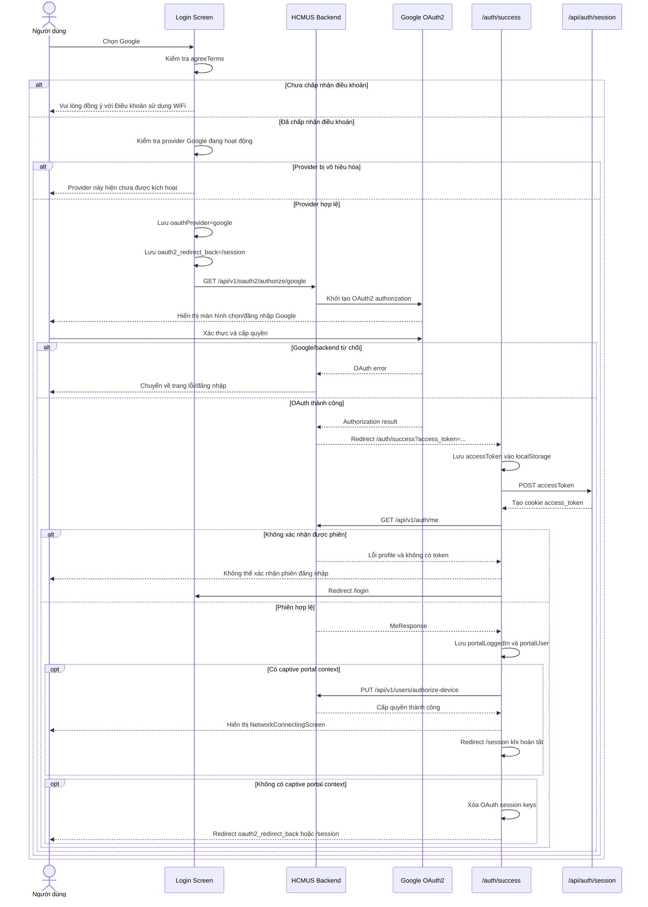

# AUTH00003 - ĐĂNG NHẬP VỚI GOOGLE

| System Name | HCMUS WiFi Management | Create Date | 15/07/2026 | Create By | Development Team |
|---|---|---|---|---|---|---|
| Function Name | Auth00003 - Đăng nhập với Google | Edit Date | 15/07/2026 | Update By | Development Team |
| Form ID | Auth00003 |  |  |  |  |
| Form Name | Google OAuth2 Login |  |  |  |  |

## History

| No | Ver. | CreateAt | Create By | UpdateAt | Update By | Update Content |
|---:|---:|---|---|---|---|---|
| 1 | 1.0 | 15/07/2026 | Development Team | 15/07/2026 | Development Team | Tạo tài liệu đặc tả đăng nhập Google OAuth2 theo ứng dụng hiện tại. |

---

# 1.Purpose

| Purpose |
|---|
| Cho phép Cán bộ, Sinh viên và Khách đăng nhập bằng tài khoản Google thông qua OAuth2. Frontend chuyển người dùng đến backend OAuth endpoint; backend làm việc với Google và redirect về `/auth/success`; frontend hoàn tất cookie phiên, tải profile, cấp quyền thiết bị captive portal và chuyển đến màn hình phiên truy cập. |

---

# 2.Screen Layout

## Màn hình: Chọn Google - Cán bộ / Sinh viên

```text
+------------------------------------------------------+
|             TRƯỜNG ĐẠI HỌC KHOA HỌC TỰ NHIÊN         |
+------------------------------------------------------+
| [Cán bộ / Sinh viên - active]            [Khách]     |
|                                                      |
|       Đăng nhập bằng tài khoản được nhà trường cấp    |
|                                                      |
|       +----------------+  +--------------------+      |
|       | [G] Google     |  | [M] Microsoft      |      |
|       +----------------+  +--------------------+      |
|                                                      |
| [ ] Tôi đồng ý với [Điều khoản sử dụng WiFi]         |
+------------------------------------------------------+
```

## Màn hình: Chọn Google - Khách

```text
+------------------------------------------------------+
| [Cán bộ / Sinh viên]             [Khách - active]    |
|                                                      |
|               [Form tài khoản/mật khẩu]              |
|                                                      |
| --------------- hoặc đăng nhập bằng ---------------- |
|             [Google] [Microsoft] [Facebook]          |
|                                                      |
| [ ] Tôi đồng ý với [Điều khoản sử dụng WiFi]         |
+------------------------------------------------------+
```

## Màn hình: OAuth callback

```text
+------------------------------------------------------+
|                                                      |
|               Đang hoàn tất đăng nhập...             |
|                                                      |
|             [Thông báo lỗi nếu thất bại]             |
|                                                      |
+------------------------------------------------------+
```

---

# 3.Sequence Diagram



---

# 4.Screen Items

Ký hiệu:

- `(I/O)` - `I`: Input / `O`: Output / `I/O`: Input-Output.
- `(Type)` - `L`: Label / `C`: Checkbox / `B`: Button / `H`: Hidden / `I`: Image / `O`: Other.

| STT | Item Name | Field Name | I/O | Type | Data Format | Size | Default value | Function ID | Notes |
|---:|---|---|:---:|:---:|---|---:|---|---|---|
| 1 | Google - internal | google_internal_button | I | B | OAuth provider | Full width | Enabled | ACT-001 | Nút lớn trong tab Cán bộ / Sinh viên. |
| 2 | Google logo - internal | google_internal_logo | O | I | PNG | 24 px | `/google.png` | - | Logo hiện trong nút Google lớn. |
| 3 | Google - guest | google_guest_button | I | B | OAuth provider | Compact | Enabled | ACT-001 | Nút compact trong tab Khách. |
| 4 | Google logo - guest | google_guest_logo | O | I | PNG | 26 px | `/google.png` | - | Logo hiện trong nhóm social login. |
| 5 | Đồng ý điều khoản | agreeTerms | I/O | C | Boolean | - | false | ACT-002 | Bắt buộc trước khi redirect OAuth. |
| 6 | Điều khoản sử dụng WiFi | terms_link | I | B | Link button | - | Enabled | ACT-003 | Mở dialog điều khoản. |
| 7 | OAuth provider | oauthProvider | I/O | H | String | - | Rỗng | ACT-004 | Lưu `google` trong sessionStorage. |
| 8 | Redirect back | oauth2_redirect_back | I/O | H | Path | - | `/session` | ACT-004 | Trang chuyển đến sau callback. |
| 9 | Đang hoàn tất đăng nhập | processing_message | O | L | String | - | Hiện | ACT-005 | Hiện trong lúc callback xử lý phiên. |
| 10 | Thông báo callback lỗi | oauth_error | O | L | String | - | Ẩn | ACT-006 | Hiện khi profile/phiên/authorize device thất bại. |
| 11 | Network connecting | network_connecting | O | O | Component | Full screen | Ẩn | ACT-007 | Hiện sau khi authorize thiết bị captive thành công. |

---

# 5.Data Input Checking

| NO | Label Name | Field Name | I/O | Type | Data Format | Required | Rule | MessageId | Message |
|---:|---|---|:---:|:---:|---|:---:|---|---|---|
| 1 | Điều khoản sử dụng WiFi | agreeTerms | I | C | Boolean | x | Phải bằng `true` trước khi khởi tạo OAuth. | ERR_001 | Vui lòng đồng ý với Điều khoản sử dụng WiFi. |
| 2 | Google provider | provider | I | H | String | x | Giá trị phải là `google`. | ERR_002 | Provider không hợp lệ. |
| 3 | Provider active | activeProviderCodes | I/O | O | string[] |  | Nếu danh sách không rỗng thì phải chứa `google`. | ERR_003 | Provider này hiện chưa được kích hoạt trên hệ thống. |
| 4 | Access token | access_token | I/O | H | String/JWT |  | Lấy từ query callback hoặc localStorage/cookie hiện có. | ERR_004 | Không thể xác nhận phiên đăng nhập từ backend. |
| 5 | User profile | MeResponse | O | O | Object | x | `GET /auth/me` phải thành công, hoặc phải có session token hợp lệ để fallback. | ERR_004 | Không thể xác nhận phiên đăng nhập từ backend. |
| 6 | Captive context | portalCaptiveContext | I/O | H | Object |  | Nếu tồn tại thì payload authorize device phải tạo được và API phải thành công. | ERR_005 | Xác thực thiết bị thất bại. Vui lòng thử lại. |

---

# 6.Data Items

## Khởi tạo Google OAuth2

**URI:** `/api/v1/oauth2/authorize/google`  
**Method:** `GET` qua browser redirect

### Request data

Không có body. Browser được chuyển trực tiếp đến endpoint backend. Backend chịu trách nhiệm tạo OAuth request và redirect đến Google.

## OAuth callback frontend

**URI:** `/auth/success`  
**Method:** `GET` qua browser redirect

| Tên trường | Vị trí | Loại dữ liệu | Required | Ghi chú |
|---|---|---|---|:---:|---|
| access_token | Query string | string |  | Token backend trả về theo triển khai hiện tại. Callback cũng chấp nhận token đã có trong localStorage/cookie. |

## Tạo cookie phiên

**URI:** `/api/auth/session`  
**Method:** `POST`

| Tên trường | Loại dữ liệu | Required | Ghi chú |
|---|---|---|:---:|---|
| accessToken | string | x | Token đọc từ callback query. |

## Lấy profile OAuth

**URI:** `/api/v1/auth/me`  
**Method:** `GET`

| Trường | Loại dữ liệu | Ghi chú |
|---|---|---|
| id | string/number | ID người dùng. |
| username | string \| null | Tên đăng nhập; fallback sang email. |
| fullName | string \| null | Họ tên; fallback sang username hoặc `OAuth2 User`. |
| email | string \| null | Email Google. |
| roles | string[] | Vai trò; fallback `CLIENT`. |
| status | string | Trạng thái tài khoản. |
| avatarUrl | string \| null | Ảnh đại diện Google/backend. |
| lastLoginAt | string \| null | Thời điểm đăng nhập gần nhất. |

## Local/session storage

| Key | Storage | Giá trị | Thời điểm xóa |
|---|---|---|---|
| oauthProvider | sessionStorage | `google` | Sau callback hoàn tất hoặc authorize device thành công. |
| oauth2_redirect_back | sessionStorage | `/session` | Trước khi redirect đến trang đích. |
| accessToken | localStorage | Token OAuth | Khi logout hoặc phiên không hợp lệ. |
| portalLoggedIn | localStorage | `true` | Khi logout. |
| portalUser | localStorage | JSON profile | Khi logout. |

## Cấp quyền thiết bị

**URI:** `/api/v1/users/authorize-device`  
**Method:** `PUT`

Payload được tạo từ captive portal context gồm `id`, `ap`, `ssid`, `url` và `t` nếu có.

---

# 7.Function Describe

| Function ID | Function Name | Trigger | Function Describe |
|---|---|---|---|
| ACT-001 | Khởi tạo Google login | Chọn một trong hai nút Google | Gọi `handleSSOLogin('google')`. |
| ACT-002 | Kiểm tra điều khoản | Bắt đầu SSO | Dừng luồng và hiện lỗi nếu `agreeTerms = false`. |
| ACT-003 | Chấp nhận điều khoản | Chọn checkbox hoặc chấp nhận trong dialog | Đặt `agreeTerms = true`. |
| ACT-004 | Lưu OAuth context | Provider và điều khoản hợp lệ | Lưu `oauthProvider=google`, `oauth2_redirect_back=/session`; redirect đến backend OAuth endpoint. |
| ACT-005 | Hoàn tất callback | Trang `/auth/success` được mount | Đọc token, tạo cookie, gọi profile, lưu trạng thái đăng nhập và profile. |
| ACT-006 | Xử lý callback lỗi | Profile không xác nhận được phiên | Hiện thông báo, dừng loading và redirect `/login`. |
| ACT-007 | Authorize captive device | Có captive portal context | Gọi API authorize device, xóa context, hiện màn hình kết nối và đến `/session`. |
| ACT-008 | Chuyển đến session | Không có captive context | Lấy `oauth2_redirect_back` hoặc fallback `/session`, xóa OAuth keys và reload trang đích. |
| ACT-009 | Provider availability | Danh sách provider đã tải | Nếu danh sách không rỗng và không có `google`, chặn redirect và hiện lỗi. |

---

# 8.Notes

## Security

- Triển khai hiện tại cho phép backend redirect `access_token` trên query string. URL có thể xuất hiện trong browser history, proxy log hoặc telemetry.
- Luồng production nên để backend đặt cookie `HttpOnly`, `Secure`, `SameSite` phù hợp và redirect về `/auth/success` mà không kèm token trong URL.
- Callback sau đó chỉ cần gọi `/api/v1/auth/me` bằng cookie để xác nhận phiên.
- Frontend hiện vẫn lưu access token trong localStorage; cần đánh giá lại nếu yêu cầu bảo mật ưu tiên cookie-only session.

## Provider configuration

- `fetchActiveProviders()` hiện trả về mảng rỗng do API provider config đang bị comment.
- Vì handler chỉ chặn khi danh sách provider không rỗng, Google mặc định vẫn có thể được chọn.
- Google và Azure dùng OAuth backend thật; Facebook dùng luồng mô phỏng hiện tại.

## Test

- Test Google trong cả tab Cán bộ / Sinh viên và tab Khách.
- Test chặn OAuth khi chưa chấp nhận điều khoản.
- Test provider bị vô hiệu hóa khi `activeProviderCodes` không chứa `google`.
- Test redirect đúng `/api/v1/oauth2/authorize/google`.
- Test callback có và không có `access_token` query.
- Test profile thành công, profile lỗi có token fallback và profile lỗi không có session.
- Test captive context authorize thành công/thất bại.
- Test xóa `oauthProvider` và `oauth2_redirect_back` sau luồng thành công.

## Source references

- `src/features/auth/components/AuthFeature.tsx`
- `src/components/InternalLoginTab.tsx`
- `src/components/GuestLoginTab.tsx`
- `src/components/SocialAuthButton.tsx`
- `src/features/auth/api/authApi.ts`
- `src/app/auth/success/page.tsx`
- `src/app/api/auth/session/route.ts`
- `src/lib/captivePortal.ts`
- `src/constants/appKeys.ts`
- `src/middleware.ts`

## Implementation notes

- `/auth/success` là public route trong middleware để backend có thể redirect về trước khi cookie frontend được thiết lập.
- Callback ưu tiên `oauth2_redirect_back`; giá trị hiện được đặt cố định là `/session`.
- Khi có captive context, callback không dùng redirect-back ngay mà hiện `NetworkConnectingScreen`, sau đó đến `/session`.
- `useRouter` hiện nằm trong dependency của callback nhưng chuyển hướng thực tế sử dụng `window.location.href`.
