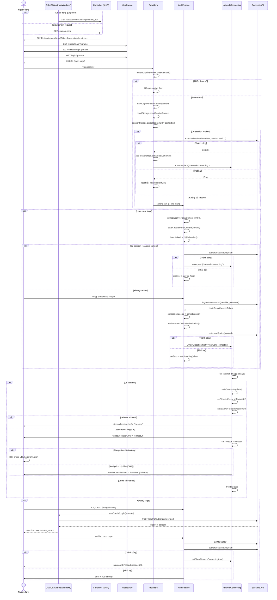

# CAPTIVE00001 - CẤP QUYỀN THIẾT BỊ CAPTIVE PORTAL

| System Name | HCMUS WiFi Management | Create Date | 20/07/2026 | Create By | Quốc Huy |
|---|---|---|---|---|---|
| Function Name | CAPTIVE00006 - Cấp quyền thiết bị Captive Portal | Edit Date | 20/07/2026 | Update By | Quốc Huy |
| Form ID | CAPTIVE00001 |  |  |  |  |
| Form Name | Captive Portal - Cấp quyền thiết bị |  |  |  |  |

## History

| No | Ver. | CreateAt | Create By | UpdateAt | Update By | Update Content |
|---:|---:|---|---|---|---|---|
| 1 | 1.0 | 20/07/2026 | Quốc Huy | 20/07/2026 | Quốc Huy | Tạo tài liệu đặc tả luồng captive portal hợp nhất (không phân biệt CNA/Browser). |

---

# 1.Purpose

| Purpose |
|---|
| Cho phép thiết bị chưa được cấp quyền (un-authorized) truy cập Internet thông qua captive portal flow. Controller (UniFi) intercept request HTTP đầu tiên và redirect về portal. Hệ thống xác thực người dùng (đăng nhập hoặc session có sẵn), gọi API authorize-device để whitelist thiết bị trên controller, sau đó mở Internet. |

---

# 2.Screen Layout

## Màn hình: Portal Redirect - /guest/\{clientMac\}?id=...&ap=...&ssid=...&url=...

```text
+------------------------------------------------------+
|  Controller intercepts HTTP request                   |
|                                                        |
|  GET /guest/{mac}?id=AA:BB:CC:DD:EE:FF               |
|                    &ap=11:22:33:44:55:66              |
|                    &ssid=HCMUS-WiFi                   |
|                    &url=http://example.com             |
|                                                        |
|  Middleware redirects → /login?<params>               |
+------------------------------------------------------+
```

## Màn hình: /network-connecting (sau khi xác thực)

```text
+------------------------------------------------------+
|                                                        |
|          [Spinner / CheckCircle]                       |
|                                                        |
|      Xác thực thành công!                              |
|   (hoặc Kết nối mạng thành công!)                      |
|                                                        |
|   Đang thiết lập đường truyền thực tế...              |
|                                                        |
|   [============>           ] Đã chờ 3s                |
|                                                        |
+------------------------------------------------------+
```

---

# 3.Sequence Diagram



---

# 4.Screen Items

Ký hiệu:

- `(I/O)` - `I`: Input / `O`: Output / `I/O`: Input-Output.
- `(Type)` - `L`: Label / `B`: Button / `I`: Image / `Ln`: Link / `Ic`: Icon / `O`: Other.

| STT | Item Name | Field Name | I/O | Type | Data Format | Default value | Function ID | Notes |
|---:|---|:---:|:---:|---|---|---|---|---|
| 1 | URL params (id, ap, ssid, url, t) | URLSearchParams | I | O | Query string | - | CP-001 | Từ controller redirect. Thiếu 1 trong 4 params (id/ap/ssid/url) → không phải captive. |
| 2 | Captive context localStorage | portalCaptiveContext | I/O | O | JSON {id,ap,ssid,url,t} | null | CP-002 | Lưu sau extract, xoá sau khi authorize thành công. |
| 3 | Redirect URL sessionStorage | portalRedirectUrl | I/O | O | String (URL) | null | CP-003 | Lưu riêng để dùng ở bước redirect cuối. |
| 4 | Spinner loading | connecting_spinner | O | Ic | Loader2 (lucide) | Xoay | CP-004 | Hiển thị khi đang kiểm tra Internet. |
| 5 | CheckCircle success | success_icon | O | Ic | CheckCircle (lucide) | Ẩn | CP-005 | Hiện khi có Internet. |
| 6 | Trạng thái "Xác thực thành công!" | connecting_text | O | L | String | Xác thực thành công! | CP-006 | Tiêu đề khi đang chờ. |
| 7 | Trạng thái "Kết nối mạng thành công!" | success_text | O | L | String | Kết nối mạng thành công! | CP-007 | Tiêu đề sau khi có Internet. |
| 8 | Thanh chạy + "Đã chờ Xs..." | progress_bar | O | O | Progress bar | Ẩn | CP-008 | Ẩn sau khi success. |
| 9 | Toast lỗi auto-authorize | error_toast | O | O | Toast (sonner) | Ẩn | CP-009 | Khi authorizeDevice thất bại từ Providers. |
| 10 | Error text login | login_error | O | L | String | Ẩn | CP-010 | Khi authorizeDevice thất bại từ AuthFeature. |
| 11 | Fallback redirect | fallback_timer | I | O | Timer 3s | Ẩn | CP-011 | navigateOrFallback, nếu window.location.href không navigate. |

---

# 5.Data Input Checking

| NO | Label Name | Field Name | I/O | Type | Data Format | Required | Rule | MessageId | Message/Behavior |
|---:|---|:---:|:---:|---|:---:|---|---:|---|---|
| 1 | id (deviceMac) | URL param id | I | String | MAC address | x | Phải khác rỗng. Nếu thiếu → `extractCaptivePortalContext` trả null. | CP_ERR_001 | Không đủ tham số captive → vào luồng web thông thường. |
| 2 | ap (apMac) | URL param ap | I | String | MAC address | x | Phải khác rỗng. | CP_ERR_001 | Không đủ tham số captive. |
| 3 | ssid | URL param ssid | I | String | WiFi name | x | Phải khác rỗng. | CP_ERR_001 | Không đủ tham số captive. |
| 4 | url | URL param url | I | String | URL | x | Phải khác rỗng. Có thể là probe URL (generate_204, hotspot-detect.html) hoặc URL thật. | CP_ERR_001 | Không đủ tham số captive. |
| 5 | t | URL param t | I | String | Timestamp | | Optional từ controller. | - | Không ảnh hưởng luồng. |
| 6 | Session cookie | access_token cookie | I | String | JWT | | Phải tồn tại để auto-authorize. Nếu có token nhưng không cookie → xoá token cũ. | CP_ERR_002 | Token cũ/mất cookie → clear localStorage. |
| 7 | accessToken | STORAGE_KEYS.accessToken | I | String | JWT | | Đồng bộ với cookie. | CP_ERR_002 | Dùng setSessionCookie() để đồng bộ. |
| 8 | redirectUrl | sessionStorage.portalRedirectUrl | I/O | String | URL | | Lưu cùng lúc với saveCaptivePortalContext. Xoá sau khi navigateOrFallback. | - | Nếu null hoặc probe → fallback /session. |

---

# 6.Data Items

## Cấp quyền thiết bị

**URI:** `/api/v1/users/authorize-device`  
**Method:** `PUT`

### Request body: AuthorizeDevicePayload

| Trường | Loại dữ liệu | Required | Ghi chú |
|---|---|---|---|
| deviceMac | string | x | `id` từ captive context. |
| apMac | string | x | `ap` từ captive context. |
| ssid | string | x | `ssid` từ captive context. |
| deviceType | string | | LAPTOP, MOBILE, TABLET, OTHER. Từ `detectDeviceCategory()` theo User-Agent. |
| deviceName | string | | Từ `detectDeviceName()` theo User-Agent. |
| userIpAddress | string | | Mặc định "0.0.0.0". Backend tự lấy IP thật. |
| userAgent | string | | `navigator.userAgent`. |
| duration | number | | Số giây cấp quyền. Mặc định 480 (8 phút). |
| manufacturer | string | | Apple, Samsung, Dell, ... Từ `detectManufacturer()`. |
| operatingSystem | string | | Windows 10/11, macOS 14, Android 14, ... Từ `detectOS()`. |

### Response

| Status | Body | Ý nghĩa |
|---|---|---|
| 200 | - | Thành công, thiết bị đã được whitelist. |
| 4xx | Error | Thất bại (thiếu param, device không tồn tại trên controller, ...). |
| 5xx | Error | Lỗi backend. |

## Đăng nhập

**URI:** `/api/v1/auth/login`  
**Method:** `POST`

### Request body: LoginPayload

| Trường | Loại dữ liệu | Required | Ghi chú |
|---|---|---|---|
| identifier | string | x | Email hoặc số điện thoại. |
| password | string | x | Mật khẩu. |

### Response: LoginResult

| Trường | Loại dữ liệu | Ghi chú |
|---|---|---|
| accessToken | string | JWT token. |
| refreshToken | string \| null | Refresh token. |
| roles | string[] | Vai trò người dùng. |

## Lấy profile

**URI:** `/api/v1/auth/me`  
**Method:** `GET`

### Response: MeResponse

| Trường | Loại dữ liệu | Ghi chú |
|---|---|---|
| id | number | User ID. |
| username | string | Tên đăng nhập. |
| email | string \| null | Email. |
| phone | string \| null | Số điện thoại. |
| fullName | string | Họ tên. |
| avatarUrl | string \| null | URL avatar. |
| status | enum | ACTIVE, INACTIVE, SUSPENDED, PENDING. |
| roles | string[] | Vai trò. |

---

# 7.Function Describe

| Function ID | Function Name | Trigger | Function Describe |
|---|---|---|---|
| CP-001 | Extract captive context | URL contains id, ap, ssid, url | `extractCaptivePortalContext(search)` — kiểm tra và parse query params. Trả null nếu thiếu bất kỳ tham số bắt buộc nào. |
| CP-002 | Save captive context | Sau extract thành công | `saveCaptivePortalContext(context)` — lưu full context vào localStorage, lưu `url` vào sessionStorage riêng. |
| CP-003 | Auto-authorize khi có session | Providers mount, có context + token | Gọi `authorizeDevice()`; thành công → `/network-connecting`; thất bại → toast lỗi + clearRedirectUrl(). |
| CP-004 | Xử lý redirect khi có session | AuthFeature mount, có session + context | `handleRedirectWithSession` — nếu user đã login → auto-authorize → `/network-connecting`. |
| CP-005 | Xử lý redirect sau login | Login thành công | `redirectAfterDeviceAuthorization` — nếu có captive context → `authorizeDeviceInBackground()` → thành công → `/network-connecting`, thất bại → error. |
| CP-006 | Kiểm tra Internet | Load /network-connecting | Poll `https://www.google.com/favicon.ico` mỗi 2 giây bằng Image API. onload = có Internet. |
| CP-007 | Hiển thị thành công | Có Internet | `setIsConnecting(false)` → UI chuyển check + "Kết nối mạng thành công!". |
| CP-008 | Redirect cuối | 1 giây sau success | `navigateOrFallback(redirectUrl)` — `window.location.href = url`, fallback timer 3s → /session. |
| CP-009 | OAuth2 callback | /auth/success?access_token=... | Lấy profile, authorize device nếu có context, show NetworkConnectingScreen. |
| CP-010 | Xử lý authorize thất bại | API authorizeDevice lỗi | Providers → toast lỗi; AuthFeature → set error text trên form; giữ captive context để retry. |

---

# 8.Notes

## Implementation status

- Luồng captive portal đã hợp nhất — không phân biệt CNA (iOS/macOS) hay browser thật. Cả hai đều đi chung một đường xử lý.
- `extractCaptivePortalContext` kiểm tra đồng thời id, ap, ssid, url — thiếu bất kỳ cái nào đều trả null.
- Captive context được lưu vào localStorage (`portalCaptiveContext`) và sessionStorage (`portalRedirectUrl`) ngay khi phát hiện, trước khi bất kỳ navigation nào xảy ra.
- `saveCaptivePortalContext` lưu `url` vào sessionStorage riêng vì localStorage bị xoá ở bước authorize. sessionStorage sống sót qua full page navigation (window.location.href).
- `navigateOrFallback` sử dụng `window.location.href` + fallback timer 3s. Nếu navigation bị chặn (WKWebView CNA), fallback về `/session`.
- Khi authorize-device thất bại (bất kỳ đâu), context KHÔNG bị xoá để cho phép retry.
- Nút "Hoàn tất" trên network-connecting đã được loại bỏ — redirect hoàn toàn tự động.
- Debug overlay (show params trên màn hình) đã được loại bỏ.

## Probe URL detection

Các hostname probe của OS được định nghĩa trong `captivePortal.ts`:

| Hostname | OS |
|---|---|
| connectivitycheck.gstatic.com | Android, Chrome |
| captive.apple.com | iOS, macOS |
| www.msftconnecttest.com | Windows |
| www.msftncsi.com | Windows |
| clients3.google.com | Chrome/Chromium |
| www.gstatic.com | Various |
| connectivitycheck.android.com | Android |
| nmcheck.gnome.org | Linux/GNOME |
| detectportal.firefox.com | Firefox |

`isProbeUrl(url)` kiểm tra hostname có match danh sách trên không. Kết quả được dùng trong `navigateOrFallback`: nếu URL là probe → fallback `/session`.

## Luồng OAuth2

1. User chọn SSO (Google/Azure) trên form login.
2. `startOAuth2Login(provider)` → redirect đến backend.
3. Backend xử lý OAuth, callback về `/auth/success?access_token=...`.
4. `/auth/success` lấy profile, authorize device (nếu có captive context), show NetworkConnectingScreen.
5. Sau network-connecting → `navigateOrFallback` như bình thường.

## Captive context lifetime

| Giai đoạn | localStorage (portalCaptiveContext) | sessionStorage (portalRedirectUrl) |
|---|---|---|
| Extract từ URL | ✅ Lưu | ✅ Lưu |
| Authorize thành công | ❌ Xoá | ✅ Giữ |
| Authorize thất bại | ✅ Giữ (cho retry) | ❌ Xoá |
| Trước navigateOrFallback | ❌ (đã xoá) | ✅ Còn |
| Sau navigateOrFallback | ❌ | ❌ Xoá |

## Test

- Test redirect từ controller với đủ 4 params id, ap, ssid, url.
- Test redirect từ controller thiếu 1 trong 4 params → vào luồng web thường.
- Test auto-authorize khi có sẵn session (cookie + token).
- Test form login → login thành công → authorize device → network-connecting → redirect.
- Test OAuth2 login → /auth/success → authorize device → network-connecting → redirect.
- Test authorize device thất bại → hiển thị lỗi + retry được.
- Test network-connecting: poll internet → success → 1s → navigateOrFallback.
- Test navigateOrFallback với probe URL → fallback /session.
- Test navigateOrFallback với URL thật → redirect đến URL đó.
- Test trên thiết bị thật (iOS CNA, Android CNA, browser) — redirect cuối có hoạt động không.
- Test navigateOrFallback fallback timer (mô phỏng navigation bị chặn) → sau 3s về /session.

## Source references

- `src/lib/captivePortal.ts`
- `src/app/providers.tsx`
- `src/middleware.ts`
- `src/features/auth/components/AuthFeature.tsx`
- `src/features/auth/hooks/useCaptiveAuthorization.ts`
- `src/features/auth/api/authApi.ts`
- `src/components/NetworkConnectingScreen.tsx`
- `src/app/network-connecting/page.tsx`
- `src/app/auth/success/page.tsx`
- `src/app/guest/[...slug]/page.tsx`
- `src/constants/appKeys.ts`
- `src/features/auth/types/index.ts`
