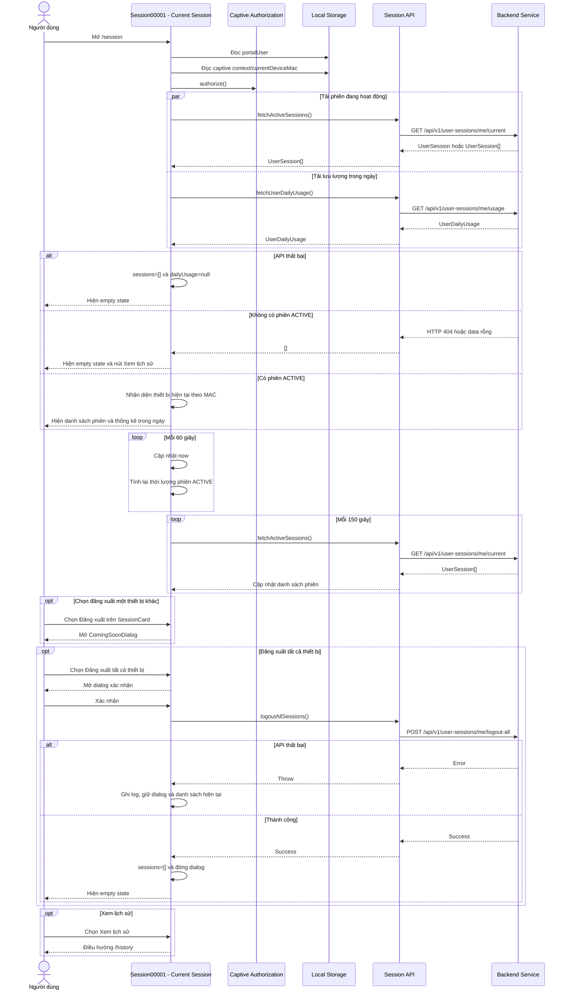

# SESSION00001 - PHIÊN HIỆN TẠI

| System Name | HCMUS WiFi Management | Create Date | 16/07/2026 | Create By | Quốc Huy |
|---|---|---|---|---|---|---|
| Function Name | Session00006 - Phiên hiện tại | Edit Date | 16/07/2026 | Update By | Quốc Huy |
| Form ID | Session00006 |  |  |  |  |
| Form Name | Phiên đang hoạt động |  |  |  |  |

## History

| No | Ver. | CreateAt | Create By | UpdateAt | Update By | Update Content |
|---:|---:|---|---|---|---|---|
| 1 | 1.0 | 16/07/2026 | Quốc Huy | 16/07/2026 | Quốc Huy | Tạo tài liệu đặc tả màn hình phiên hiện tại theo ứng dụng hiện tại. |

---

# 1.Purpose

| Purpose |
|---|
| Cho phép người dùng xem tất cả phiên WiFi đang hoạt động của tài khoản, nhận biết thiết bị hiện tại, theo dõi thời lượng và lưu lượng của từng phiên, xem tổng lưu lượng trong ngày, truy cập lịch sử phiên và đăng xuất tất cả thiết bị. |

---

# 2.Screen Layout

## Màn hình: Phiên đang hoạt động

```text
+------------------------------------------------------+
| HCMUS WiFi                         [User] [Đăng xuất] |
+------------------------------------------------------+
| Phiên đang hoạt động                    [N thiết bị] |
|------------------------------------------------------|
| [Icon] Tên thiết bị            Thiết bị này   01:23 |
|        SSID                                          |
| MAC    AA:BB:CC:DD:EE:FF     IP    192.168.1.10     |
| [Download]          [Upload]             [Tổng]      |
|                                                      |
|                                [Đăng xuất]           |
|------------------------------------------------------|
| ... Các phiên đang hoạt động khác ...                |
|------------------------------------------------------|
| Thống kê sử dụng trong ngày                          |
| [Download]          [Upload]             [Tổng]      |
|                                                      |
|              [Đăng xuất tất cả thiết bị]             |
+------------------------------------------------------+
```

Nút `Đăng xuất` trong từng card chỉ hiện với thiết bị không được nhận diện là thiết bị hiện tại.

## Empty state: Không có phiên

```text
+------------------------------------------------------+
|                       [WiFi]                         |
|                  Chưa có phiên nào                   |
|          Hiện tại bạn chưa kết nối WiFi.             |
|                                                      |
|                   [Xem lịch sử]                      |
+------------------------------------------------------+
```

## Dialog: Đăng xuất tất cả

```text
+------------------------------------------------------+
| Đăng xuất tất cả?                                    |
|                                                      |
| Tất cả thiết bị sẽ ngắt kết nối WiFi.                |
|                                                      |
|                         [Hủy] [Đăng xuất tất cả]      |
+------------------------------------------------------+
```

## Dialog: Chức năng sắp ra mắt

```text
+------------------------------------------------------+
| Chức năng sắp ra mắt                                 |
|                                                      |
| Đăng xuất một phiên riêng lẻ chưa được triển khai.   |
|                                                      |
|                                      [Đóng]          |
+------------------------------------------------------+
```

---

# 3.Sequence Diagram



---

# 4.Screen Items

Ký hiệu:

- `(I/O)` - `I`: Input / `O`: Output / `I/O`: Input-Output.
- `(Type)` - `L`: Label / `B`: Button / `I`: Image / `Ln`: Link / `Ic`: Icon / `O`: Other.

| STT | Item Name | Field Name | I/O | Type | Data Format | Default value | Function ID | Notes |
|---:|---|---|:---:|:---:|---|---|---|---|
| 1 | Tên người dùng | portalUser.fullname | O | L | String | Guest | ACT-001 | Đọc từ localStorage sau khi component mount. |
| 2 | Vai trò | portalUser.role | O | L | String | Student | ACT-001 | Ẩn trên màn hình nhỏ. |
| 3 | Đăng xuất trên header | header_logout | I | B/Ic | Button | Enabled | ACT-012 | Mở dialog đăng xuất tất cả phiên, không phải logout ứng dụng. |
| 4 | Loading | loading_state | O | O | Spinner | Hiện khi tải lần đầu | ACT-002 | Hiện nội dung `Đang tải...`. |
| 5 | Empty state | empty_state | O | O | State | Ẩn | ACT-003 | Hiện khi `sessions.length=0`, bao gồm cả trường hợp API lỗi. |
| 6 | Xem lịch sử | history_link | I | B/Ln | Link | Enabled | ACT-004 | Điều hướng tới `/history`. |
| 7 | Phiên đang hoạt động | section_title | O | L | String | Phiên đang hoạt động | ACT-005 | Tiêu đề danh sách phiên. |
| 8 | Số thiết bị | sessionCount | O | L | Integer | 0 thiết bị | ACT-005 | Bằng số phần tử trong `sessions`. |
| 9 | Icon thiết bị | deviceUserInfo.deviceType | O | Ic | Enum | Monitor | ACT-006 | Laptop, Smartphone, Tablet hoặc icon mặc định. |
| 10 | Tên thiết bị | deviceUserInfo.deviceName | O | L | String | - | ACT-006 | Có truncate khi nội dung dài. |
| 11 | Thiết bị này | isCurrentDevice | O | L | Badge | Ẩn | ACT-007 | Chỉ hiện khi MAC phiên khớp MAC thiết bị hiện tại. |
| 12 | SSID | ssid | O | L | String | - | ACT-006 | Tên mạng WiFi của phiên. |
| 13 | Thời lượng hoạt động | activeDuration | O | L | Duration | 00:00 | ACT-008 | Tính từ `startTime` đến `now`, cập nhật mỗi 60 giây. |
| 14 | MAC thiết bị | deviceUserInfo.macAddress | O | L | MAC address | - | ACT-006 | So sánh không phân biệt chữ hoa/thường khi nhận diện thiết bị hiện tại. |
| 15 | IP thiết bị | ipAddress | O | L | IP address | - | ACT-006 | Địa chỉ IP client của phiên. |
| 16 | Download phiên | downloadBytes | O | L | Bytes | 0 B | ACT-009 | Format bằng `formatBytes`. |
| 17 | Upload phiên | uploadBytes | O | L | Bytes | 0 B | ACT-009 | Format bằng `formatBytes`. |
| 18 | Tổng lưu lượng phiên | sessionTotalBytes | O | L | Bytes | 0 B | ACT-009 | `downloadBytes + uploadBytes`. |
| 19 | Đăng xuất phiên | session_logout | I | B/Ic | Button | Enabled | ACT-010 | Chỉ hiện với thiết bị khác; hiện tại mở ComingSoonDialog. |
| 20 | Thống kê sử dụng trong ngày | daily_usage_title | O | L | String | Ẩn | ACT-011 | Card chỉ hiện khi `dailyUsage` khác null. |
| 21 | Download trong ngày | totalDownloadBytes | O | L | Bytes | 0 B | ACT-011 | Format bằng `formatBytes`. |
| 22 | Upload trong ngày | totalUploadBytes | O | L | Bytes | 0 B | ACT-011 | Format bằng `formatBytes`. |
| 23 | Tổng lưu lượng trong ngày | totalBytes | O | L | Bytes | 0 B | ACT-011 | Dữ liệu do backend trả về. |
| 24 | Đăng xuất tất cả thiết bị | logout_all | I | B/Ic | Button | Enabled | ACT-012 | Mở dialog xác nhận. |
| 25 | Dialog đăng xuất tất cả | logout_all_dialog | I/O | O | Dialog | Closed | ACT-012 | Tiêu đề `Đăng xuất tất cả?`. |
| 26 | Hủy | logout_all_cancel | I | B | Button | Enabled | ACT-013 | Đóng dialog, không gọi API. |
| 27 | Xác nhận đăng xuất tất cả | logout_all_confirm | I | B | Button | Enabled | ACT-013 | Gọi `logoutAllSessions()`. |
| 28 | Coming soon | coming_soon_dialog | O | O | Dialog | Closed | ACT-010 | Thay cho chức năng logout từng phiên chưa hoàn thiện. |

---

# 5.Data Input Checking

| NO | Label Name | Field Name | I/O | Type | Data Format | Required | Rule | MessageId | Message/Behavior |
|---:|---|---|:---:|:---:|---|:---:|---|---|---|
| 1 | MAC thiết bị hiện tại | currentDeviceMac | I/O | O | MAC address |  | Ưu tiên `captiveContext.id`, sau đó `STORAGE_KEYS.currentDeviceMac`. So sánh không phân biệt hoa/thường. | INFO_001 | Nếu không có hoặc không khớp, không phiên nào hiển thị badge `Thiết bị này`. |
| 2 | Session ID | sessionId | I | O | String | x | Phải thuộc một phiên đang hiển thị. | ERR_001 | API logout từng phiên đã tồn tại nhưng UI chưa gọi API. |
| 3 | Xác nhận logout tất cả | logout_all_confirm | I | B | Boolean | x | Chỉ gọi API sau khi người dùng chọn `Đăng xuất tất cả`. | INFO_002 | Chọn `Hủy` đóng dialog và không thay đổi dữ liệu. |
| 4 | Thời gian bắt đầu | startTime | O | L | ISO datetime | x | Duration không âm; `Math.max(0, now-startTime)`. | INFO_003 | Hiển thị bằng định dạng thời lượng rút gọn. |
| 5 | Lưu lượng | downloadBytes/uploadBytes | O | L | Number | x | Tổng phiên bằng download cộng upload. | INFO_004 | Giá trị được format sang B/KB/MB/GB. |
| 6 | Ngày thống kê | date | I/O | O | yyyy-MM-dd |  | Không truyền query thì backend dùng ngày hiện tại. | ERR_002 | UI hiện không có bộ chọn ngày. |

---

# 6.Data Items

## Lấy các phiên đang hoạt động

**URI:** `/api/v1/user-sessions/me/current`  
**Method:** `GET`

API hỗ trợ `data` là một `UserSession`, một mảng `UserSession[]` hoặc rỗng. Frontend luôn chuẩn hóa kết quả thành mảng. HTTP 404 được xử lý như không có phiên và trả về `[]`.

### UserSession

| Trường | Loại dữ liệu | Ghi chú |
|---|---|---|
| sessionId | string | Mã phiên, dùng làm React key và payload logout từng phiên. |
| ipAddress | string | IP client. |
| startTime | string | ISO datetime bắt đầu phiên. |
| endTime | string \| null | Null với phiên ACTIVE. |
| status | enum | ACTIVE, ENDED, EXPIRED hoặc FAILED. Màn hình này dự kiến chỉ nhận ACTIVE. |
| createdAt | string | Thời gian tạo bản ghi. |
| ssid | string | Tên WiFi. |
| vlan | string | VLAN; model có nhưng màn hình không hiển thị. |
| apMac | string | MAC access point; model có nhưng màn hình không hiển thị. |
| downloadBytes | number | Tổng download của phiên. |
| uploadBytes | number | Tổng upload của phiên. |
| terminateCause | string \| null | Dự kiến null với phiên ACTIVE; màn hình không hiển thị. |
| deviceUserInfo | DeviceUserInfo | Thông tin người dùng và thiết bị. |

### DeviceUserInfo fields used by Current Session

| Trường | Loại dữ liệu | Ghi chú |
|---|---|---|
| deviceType | string \| null | Dùng chọn icon và màu icon. |
| deviceName | string | Tên thiết bị hiển thị trên card. |
| macAddress | string | Hiển thị và nhận diện thiết bị hiện tại. |
| isOnline | boolean | Có trong model nhưng card hiện không sử dụng. |
| ssid | string | Có trong model nhưng card dùng `UserSession.ssid`. |
| apMac | string | Có trong model nhưng card hiện không hiển thị. |

## Lấy lưu lượng trong ngày

**URI:** `/api/v1/user-sessions/me/usage`  
**Method:** `GET`

### Query parameters

| Trường | Loại dữ liệu | Required | Default | Ghi chú |
|---|---|:---:|---|---|
| date | string |  | Ngày hiện tại | Format `yyyy-MM-dd`. Màn hình hiện không truyền tham số. |

### UserDailyUsage

| Trường | Loại dữ liệu | Ghi chú |
|---|---|---|
| date | string | Ngày thống kê theo `yyyy-MM-dd`; model có nhưng card không hiển thị. |
| totalDownloadBytes | number | Tổng download trong ngày. |
| totalUploadBytes | number | Tổng upload trong ngày. |
| totalBytes | number | Tổng lưu lượng trong ngày. |

## Đăng xuất một phiên

**URI:** `/api/v1/user-sessions/me/logout`  
**Method:** `POST`

| Trường | Loại dữ liệu | Required | Ghi chú |
|---|---|:---:|---|
| sessionId | string | x | Mã phiên cần đăng xuất. API client đã có nhưng màn hình chưa gọi. |

## Đăng xuất tất cả phiên

**URI:** `/api/v1/user-sessions/me/logout-all`  
**Method:** `POST`

Không có request body. Khi thành công, frontend xóa danh sách phiên trong state và đóng dialog xác nhận.

---

# 7.Function Describe

| Function ID | Function Name | Trigger | Function Describe |
|---|---|---|---|
| ACT-001 | Khởi tạo thông tin màn hình | Mount `/session` | Đọc `portalUser`, captive context và MAC thiết bị hiện tại từ localStorage sau khi mount để tránh hydration mismatch. |
| ACT-002 | Tải dữ liệu phiên hiện tại | Mount `/session` | Authorize thiết bị nếu cần, sau đó tải song song phiên ACTIVE và lưu lượng trong ngày. |
| ACT-003 | Hiện empty state | Không có session hoặc tải dữ liệu lỗi | Hiện thông báo chưa kết nối WiFi và nút Xem lịch sử. |
| ACT-004 | Mở lịch sử phiên | Chọn Xem lịch sử | Điều hướng tới `/history`. |
| ACT-005 | Hiện danh sách phiên | `sessions.length > 0` | Hiện tiêu đề, số thiết bị và một SessionCard cho mỗi phiên. |
| ACT-006 | Hiện thông tin phiên | Render SessionCard | Hiện icon, tên thiết bị, SSID, MAC, IP và trạng thái kết nối qua duration màu xanh. |
| ACT-007 | Nhận diện thiết bị hiện tại | Render từng SessionCard | Chỉ đánh dấu khi MAC của phiên khớp `currentDeviceMac`, không sử dụng fallback theo vị trí. |
| ACT-008 | Cập nhật thời lượng | Mount và mỗi 60 giây | Tính `now-startTime`, chặn giá trị âm và format thời lượng rút gọn. |
| ACT-009 | Format lưu lượng phiên | Render SessionCard | Format download, upload và tổng lưu lượng từ bytes. |
| ACT-010 | Đăng xuất một phiên | Chọn Đăng xuất trên thiết bị khác | Hiện ComingSoonDialog; API `logoutSession()` chưa được nối vào UI. |
| ACT-011 | Hiện thống kê trong ngày | `dailyUsage` khác null | Hiện download, upload và tổng lưu lượng ngày hiện tại. |
| ACT-012 | Mở xác nhận logout tất cả | Chọn nút header hoặc nút cuối màn hình | Mở LogoutConfirmDialog với cảnh báo tất cả thiết bị sẽ ngắt WiFi. |
| ACT-013 | Đăng xuất tất cả phiên | Xác nhận dialog | Gọi API logout-all; thành công xóa sessions và đóng dialog, thất bại chỉ ghi log. |
| ACT-014 | Tự động refresh phiên | Mỗi 150 giây | Gọi lại `fetchActiveSessions()` và thay thế danh sách; không refresh daily usage. |
| ACT-015 | Captive authorization | Tải màn hình | Gọi `authorize()` trước khi fetch dữ liệu để hoàn tất cấp quyền cho thiết bị nếu còn captive context. |

---

# 8.Notes

## Implementation status

- Màn hình hỗ trợ nhiều phiên ACTIVE và chuẩn hóa response object/mảng thành `UserSession[]`.
- API logout từng phiên `logoutSession(sessionId)` đã tồn tại nhưng nút trên SessionCard hiện chỉ mở `ComingSoonDialog`.
- Hai nút `Đăng xuất` ở header và cuối màn hình đều thực hiện logout tất cả phiên WiFi, không đăng xuất tài khoản khỏi ứng dụng.
- Khi tải phiên hoặc daily usage thất bại, UI xóa cả hai state và hiển thị empty state; chưa có error state hoặc nút thử lại riêng.
- Logout tất cả chưa có loading state, khóa nút khi request đang chạy, thông báo thành công hoặc thông báo lỗi cho người dùng.
- Nếu không có hoặc không tìm thấy MAC thiết bị hiện tại, không phiên nào được đánh dấu `Thiết bị này`.
- Danh sách phiên tự refresh mỗi 150 giây, nhưng daily usage chỉ tải một lần khi mount.
- `DailyUsageCard` nhận prop `deviceCount` nhưng hiện chưa sử dụng để render.
- `UserDailyUsage.date`, `UserSession.apMac`, `UserSession.vlan` và trạng thái `deviceUserInfo.isOnline` chưa được hiển thị.

## Test

- Test loading state khi mở `/session`.
- Test API current session trả về object, mảng, dữ liệu rỗng và HTTP 404.
- Test API current session hoặc daily usage trả lỗi và hành vi empty state hiện tại.
- Test hiển thị một phiên và nhiều phiên ACTIVE.
- Test nhận diện thiết bị hiện tại bằng MAC không phân biệt hoa/thường.
- Test không hiển thị badge khi thiếu `currentDeviceMac` hoặc không có MAC nào khớp.
- Test icon Laptop, Smartphone, Tablet và loại thiết bị không xác định.
- Test duration với startTime hợp lệ, tương lai và cập nhật sau 60 giây.
- Test format download, upload và tổng lưu lượng của từng phiên.
- Test card thống kê ngày chỉ hiện khi daily usage tồn tại.
- Test auto refresh danh sách phiên sau 150 giây và lỗi refresh không xóa dữ liệu cũ.
- Test nút logout từng phiên chỉ hiện trên thiết bị khác và mở ComingSoonDialog.
- Test mở, hủy và xác nhận dialog logout tất cả từ cả hai nút.
- Test logout-all thành công xóa sessions; thất bại giữ nguyên danh sách và dialog.
- Test empty state và điều hướng `/history`.
- Test header user/role trước và sau hydration, trên mobile và desktop.

## Source references

- `src/features/session/index.tsx`
- `src/app/session/page.tsx`
- `src/features/session/components/SessionCard.tsx`
- `src/features/session/components/DailyUsageCard.tsx`
- `src/features/session/components/LogoutConfirmDialog.tsx`
- `src/features/session/api/sessionApi.ts`
- `src/features/session/utils.ts`
- `src/features/auth/types/index.ts`
- `src/features/auth/hooks/useCaptiveAuthorization.ts`
- `src/lib/captivePortal.ts`
- `src/constants/appKeys.ts`
- `src/data/mockData.ts`
- `src/components/AppLayout.tsx`
- `src/components/ComingSoonDialog.tsx`
