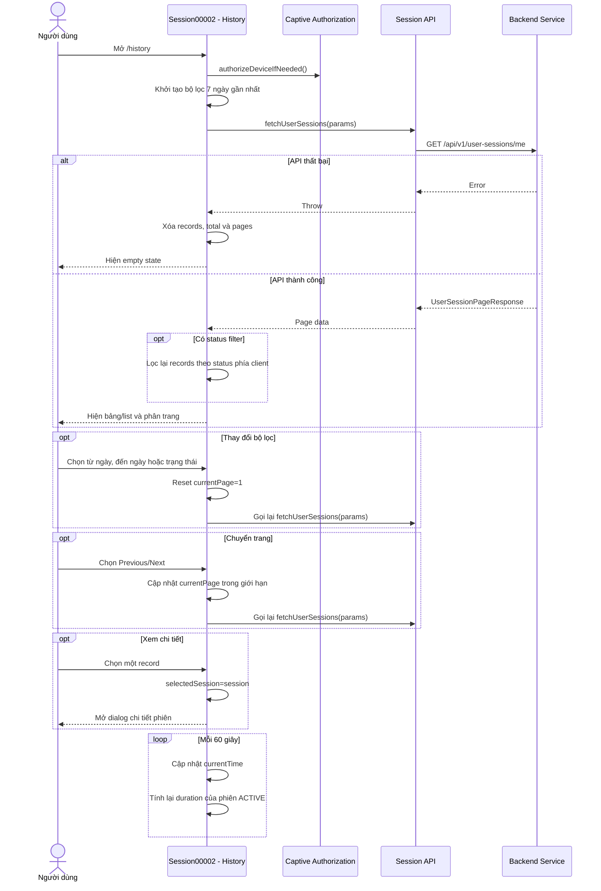

# SESSION00002 - LỊCH SỬ PHIÊN

| System Name | HCMUS WiFi Management | Create Date | 15/07/2026 | Create By | Development Team |
|---|---|---|---|---|---|---|
| Function Name | Session00002 - Lịch sử phiên | Edit Date | 15/07/2026 | Update By | Development Team |
| Form ID | Session00002 |  |  |  |  |
| Form Name | Lịch sử đăng nhập |  |  |  |  |

## History

| No | Ver. | CreateAt | Create By | UpdateAt | Update By | Update Content |
|---:|---:|---|---|---|---|---|
| 1 | 1.0 | 15/07/2026 | Development Team | 15/07/2026 | Development Team | Tạo tài liệu đặc tả lịch sử phiên truy cập theo ứng dụng hiện tại. |

---

# 1.Purpose

| Purpose |
|---|
| Cho phép người dùng xem lịch sử các phiên truy cập WiFi của tài khoản, lọc theo khoảng ngày và trạng thái, xem lưu lượng, thiết bị, mạng, thời lượng và mở dialog chi tiết của từng phiên. Dữ liệu được phân trang với 10 bản ghi mỗi trang. |

---

# 2.Screen Layout

## Màn hình: Lịch sử đăng nhập

```text
+------------------------------------------------------+
| Lịch sử đăng nhập                         [N] phiên   |
|                                      [Lọc] [Excel]   |
|------------------------------------------------------|
| Từ ngày        Đến ngày        Trạng thái            |
| [yyyy-mm-dd]   [yyyy-mm-dd]    [Tất cả v]            |
| [Xóa lọc]                                            |
|------------------------------------------------------|
| Thời gian | Thiết bị | Mạng | Thời lượng | Lưu lượng |
|------------------------------------------------------|
| Start     | Device   | SSID | 01:23       | Down/Up   |
| End       | MAC      | AP   |             | Status >  |
|------------------------------------------------------|
| 1-10 / Total                  [<] Current/Pages [>]   |
+------------------------------------------------------+
```

## Dialog: Chi tiết phiên đăng nhập

```text
+------------------------------------------------------+
| [Device icon] Chi tiết phiên đăng nhập               |
+------------------------------------------------------+
| Trạng thái                                  [Badge]   |
|------------------------------------------------------|
| Người dùng                                           |
| Username                                             |
|------------------------------------------------------|
| Thời gian                                            |
| Bắt đầu          Kết thúc                            |
| Thời lượng       Lý do kết thúc                      |
|------------------------------------------------------|
| Thiết bị                                             |
| Tên              Loại                                |
| MAC                                                  |
|------------------------------------------------------|
| Mạng                                                 |
| SSID             AP MAC                              |
|------------------------------------------------------|
| Lưu lượng                                            |
| [Download]       [Upload]       [Tổng]               |
+------------------------------------------------------+
```

---

# 3.Sequence Diagram



---

# 4.Screen Items

Ký hiệu:

- `(I/O)` - `I`: Input / `O`: Output / `I/O`: Input-Output.
- `(Type)` - `L`: Label / `T`: Text / `S`: Select / `B`: Button / `I`: Image / `Ic`: Icon / `O`: Other.

| STT | Item Name | Field Name | I/O | Type | Data Format | Default value | Function ID | Notes |
|---:|---|---|:---:|:---:|---|---|---|---|
| 1 | Lịch sử đăng nhập | page_title | O | L | String | Lịch sử đăng nhập | ACT-001 | Tiêu đề màn hình. |
| 2 | Tổng số phiên | pageData.total | O | L | Integer | 0 | ACT-001 | Hiện `[total] phiên`. |
| 3 | Lọc | filter_toggle | I/O | B | Button | Closed | ACT-002 | Ẩn/hiện vùng bộ lọc. |
| 4 | Excel | export_excel | I | B | Button | Enabled | ACT-003 | UI có nút nhưng chưa gán handler. |
| 5 | Từ ngày | dateFrom | I/O | T | Date | Hôm nay - 7 ngày | ACT-004 | Format `yyyy-MM-dd`. |
| 6 | Đến ngày | dateTo | I/O | T | Date | Hôm nay | ACT-004 | Format `yyyy-MM-dd`. |
| 7 | Trạng thái | statusFilter | I/O | S | Enum | all | ACT-004 | all, ACTIVE, ENDED, EXPIRED, FAILED. |
| 8 | SSID | ssidFilter | I/O | T | String | Rỗng | ACT-005 | State/API param có tồn tại nhưng input đang bị comment. |
| 9 | Xóa lọc | reset_filters | I | B | Button | Enabled | ACT-006 | Đặt lại 7 ngày, status all, SSID rỗng và page 1. |
| 10 | Loading | loading_state | O | O | Spinner | Hiện khi fetch | ACT-001 | Hiện `Đang tải...`. |
| 11 | Thời gian | startTime/endTime | O | L | Datetime | - | ACT-007 | Start và end của phiên. |
| 12 | Thiết bị | deviceUserInfo | O | O | Object | - | ACT-007 | Tên, MAC và icon theo loại thiết bị. |
| 13 | Mạng | ssid/apMac | O | O | String | - | ACT-007 | SSID và AP MAC. |
| 14 | Thời lượng | duration | O | L | Duration | -- | ACT-008 | ACTIVE tính đến currentTime; phiên khác tính end-start. |
| 15 | Lưu lượng | downloadBytes/uploadBytes | O | L | Bytes | 0 B | ACT-009 | Hiện download và upload đã format. |
| 16 | Trạng thái phiên | status | O | L | Badge | - | ACT-010 | Online, Kết thúc, Hết hạn, Thất bại. |
| 17 | Mobile session item | mobile_record | I/O | O | Responsive item | - | ACT-007 | Hiện tên thiết bị, SSID, start, duration và total traffic. |
| 18 | Empty state | empty_state | O | O | State | Ẩn | ACT-011 | Hiện khi không có records. |
| 19 | Previous page | previous_page | I | B/Ic | Button | Disabled page 1 | ACT-012 | Giảm page tối thiểu 1. |
| 20 | Next page | next_page | I | B/Ic | Button | Disabled last page | ACT-012 | Tăng page tối đa `pages`. |
| 21 | Chi tiết phiên | detail_dialog | O | O | Dialog | Closed | ACT-013 | Mở khi chọn row/card. |
| 22 | Lý do kết thúc | terminateCause | O | L | String | -- | ACT-014 | Mapping từ mã backend sang nhãn tiếng Việt. |

---

# 5.Data Input Checking

| NO | Label Name | Field Name | I/O | Type | Data Format | Required | Rule | MessageId | Message/Behavior |
|---:|---|---|:---:|:---:|---|:---:|---|---|---|
| 1 | Từ ngày | startDate | I | T | yyyy-MM-dd | x | Giá trị mặc định là 7 ngày trước hôm nay. | ERR_001 | UI chưa có thông báo validation riêng. |
| 2 | Đến ngày | endDate | I | T | yyyy-MM-dd | x | Giá trị mặc định là hôm nay. | ERR_002 | UI chưa chặn `startDate > endDate`. |
| 3 | Trạng thái | status | I | S | Enum |  | Chỉ nhận all, ACTIVE, ENDED, EXPIRED, FAILED. | ERR_003 | Select chỉ cung cấp các giá trị hợp lệ. |
| 4 | SSID | ssid | I | T | String |  | Trim trước khi đưa vào query. | ERR_004 | Input đang bị comment trong UI. |
| 5 | Trang | page | I/O | O | Integer | x | Tối thiểu 1, tối đa `pageData.pages`. | ERR_005 | Nút phân trang disabled tại biên. |
| 6 | Kích thước trang | size | I/O | O | Integer | x | Cố định 10 bản ghi/trang. | ERR_006 | `ITEMS_PER_PAGE=10`. |

---

# 6.Data Items

## Lấy lịch sử phiên

**URI:** `/api/v1/user-sessions/me`  
**Method:** `GET`

### Query parameters

| Trường | Loại dữ liệu | Required | Default | Ghi chú |
|---|---|---|:---:|---|---|
| status | string |  | Không gửi | ACTIVE, ENDED, EXPIRED hoặc FAILED. |
| ssid | string |  | Không gửi | Lọc theo tên WiFi. |
| startDate | string |  | Hôm nay - 7 ngày | `yyyy-MM-dd`. |
| endDate | string |  | Hôm nay | `yyyy-MM-dd`. |
| page | number |  | 1 | Số trang. |
| size | number |  | 10 | Số bản ghi mỗi trang. |

### Page response

| Trường | Loại dữ liệu | Ghi chú |
|---|---|---|
| current | number | Trang hiện tại. |
| size | number | Số bản ghi/trang. |
| total | number | Tổng bản ghi. |
| pages | number | Tổng số trang. |
| records | UserSession[] | Danh sách phiên. |
| orders | string[] | Thông tin sort nếu backend trả về. |

### UserSession

| Trường | Loại dữ liệu | Ghi chú |
|---|---|---|
| sessionId | string | Mã phiên. |
| ipAddress | string | IP client; model có nhưng UI History hiện chưa hiện. |
| startTime | string | ISO datetime bắt đầu. |
| endTime | string \| null | Null nếu phiên đang ACTIVE. |
| status | enum | ACTIVE, ENDED, EXPIRED, FAILED. |
| createdAt | string | Ngày tạo bản ghi. |
| ssid | string | Tên WiFi. |
| vlan | string | VLAN; model có nhưng UI hiện chưa hiện. |
| apMac | string | MAC của access point. |
| downloadBytes | number | Tổng download. |
| uploadBytes | number | Tổng upload. |
| terminateCause | string \| null | Lý do kết thúc. |
| deviceUserInfo | DeviceUserInfo | Thông tin user và thiết bị. |

### DeviceUserInfo fields used by History

| Trường | Loại dữ liệu | Ghi chú |
|---|---|---|
| userName | string | Username hiện trong dialog. |
| deviceName | string | Tên thiết bị. |
| deviceType | string \| null | Smartphone, Laptop, Tablet hoặc khác. |
| macAddress | string | MAC thiết bị. |

---

# 7.Function Describe

| Function ID | Function Name | Trigger | Function Describe |
|---|---|---|---|
| ACT-001 | Tải lịch sử | Mount hoặc params thay đổi | Authorize device nếu cần; tạo query; gọi API; cập nhật loading/pageData. |
| ACT-002 | Ẩn/hiện bộ lọc | Chọn Lọc | Đảo `showFilters`. |
| ACT-003 | Xuất Excel | Chọn Excel | Chưa được triển khai; nút không có handler. |
| ACT-004 | Lọc lịch sử | Đổi date/status | Cập nhật filter, reset page 1 và tự động gọi lại API. |
| ACT-005 | Lọc SSID | Nhập SSID | Logic state/query có sẵn, nhưng input đang bị comment. |
| ACT-006 | Xóa bộ lọc | Chọn Xóa lọc | Đặt date về 7 ngày gần nhất, status all, SSID rỗng, page 1. |
| ACT-007 | Hiện danh sách | API thành công | Desktop hiện table; mobile hiện danh sách compact. |
| ACT-008 | Tính thời lượng | Render record | ACTIVE tính `now-start`; phiên kết thúc tính `end-start`; cập nhật mỗi 60 giây. |
| ACT-009 | Format lưu lượng | Render record/detail | Dùng `formatBytes` cho download, upload và tổng. |
| ACT-010 | Mapping status | Render badge | ACTIVE=Online, ENDED=Kết thúc, EXPIRED=Hết hạn, FAILED=Thất bại. |
| ACT-011 | Empty state | Không loading và records rỗng | Hiện `Không tìm thấy phiên nào` và nút Xóa lọc. |
| ACT-012 | Phân trang | Chọn Previous/Next | Giới hạn page trong khoảng 1..pages và gọi lại API. |
| ACT-013 | Mở chi tiết | Chọn row/card | Gán `selectedSession` và mở dialog. |
| ACT-014 | Mapping terminate cause | Render dialog | User-Request, Session-Timeout, Idle-Timeout, Admin-Reset và fallback. |

---

# 8.Notes

## Implementation status

- Nút `Excel` hiện chỉ là UI, chưa có logic tạo/tải file.
- State và query `ssidFilter` có sẵn nhưng input SSID đang bị comment.
- UI không validate `dateFrom <= dateTo`.
- Khi API lỗi, màn hình đặt danh sách rỗng và hiện empty state; không hiện thông báo lỗi riêng.
- Sau khi nhận dữ liệu, status tiếp tục được lọc phía client để fallback cho backend không hỗ trợ filter.
- Khi lọc status phía client, `total` và `pages` vẫn giữ giá trị backend, có thể không khớp số records đang hiện.
- `ipAddress` và `vlan` có trong model nhưng chưa được hiện trong dialog chi tiết.

## Test

- Test khoảng ngày mặc định là 7 ngày gần nhất.
- Test query params status, date, page và size.
- Test status fallback filter phía client.
- Test duration ACTIVE cập nhật sau 60 giây và duration phiên đã kết thúc.
- Test desktop table và mobile list.
- Test loading, empty state và API error.
- Test biên Previous/Next và tổng pages.
- Test dialog chi tiết với endTime null, terminateCause null và deviceType null.
- Test format download/upload/total traffic.

## Source references

- `src/features/history/index.tsx`
- `src/app/history/page.tsx`
- `src/features/session/api/sessionApi.ts`
- `src/features/auth/types/index.ts`
- `src/features/auth/hooks/useCaptiveAuthorization.ts`
- `src/data/mockData.ts`
- `src/components/AppLayout.tsx`
