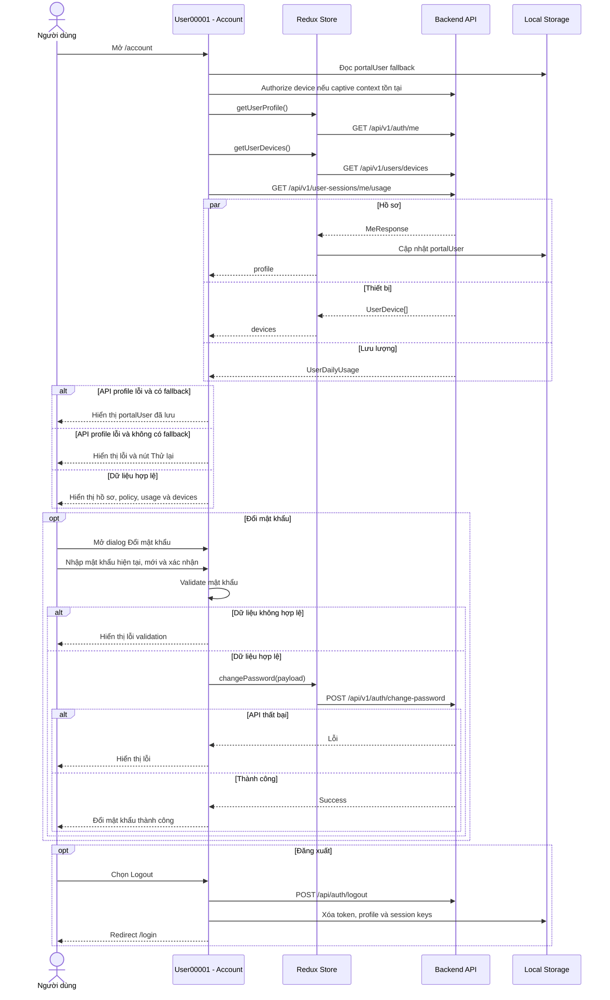

# USER00001 - THÔNG TIN TÀI KHOẢN

| System Name | HCMUS WiFi Management | Create Date | 15/07/2026 | Create By | Development Team |
|---|---|---|---|---|---|---|
| Function Name | User00001 - Thông tin tài khoản | Edit Date | 15/07/2026 | Update By | Development Team |
| Form ID | User00001 |  |  |  |  |
| Form Name | Thông tin tài khoản |  |  |  |  |

## History

| No | Ver. | CreateAt | Create By | UpdateAt | Update By | Update Content |
|---:|---:|---|---|---|---|---|
| 1 | 1.0 | 15/07/2026 | Development Team | 15/07/2026 | Development Team | Tạo tài liệu đặc tả màn hình thông tin tài khoản theo ứng dụng hiện tại. |

---

# 1.Purpose

| Purpose |
|---|
| Cho phép người dùng xem hồ sơ tài khoản, vai trò, nhóm, chính sách WiFi, tài khoản OAuth liên kết, thống kê lưu lượng trong ngày và danh sách thiết bị đã duyệt. Màn hình cũng hỗ trợ đổi mật khẩu và đăng xuất khỏi ứng dụng. |

---

# 2.Screen Layout

## Màn hình: Thông tin tài khoản

```text
+------------------------------------------------------+
| Thông tin tài khoản                  [User] [Logout] |
+------------------------------------------------------+
| [Avatar] Họ tên                                      |
|          Vai trò / Trạng thái                        |
|------------------------------------------------------|
| Thông tin cá nhân                                    |
| ID              Email                                |
| Số điện thoại   Vai trò                              |
| Nhóm                                                 |
|                                                      |
| [Đổi mật khẩu]                                       |
|------------------------------------------------------|
| Tài khoản liên kết (OAuth)                           |
| [Google/Microsoft/Facebook] Email     Trạng thái      |
+------------------------------------------------------+
| Chính sách: [Tên chính sách]                         |
| [Băng thông] [Phiên tối đa] [Giới hạn phiên]         |
| Loại xác thực                                        |
+------------------------------------------------------+
| Thống kê sử dụng - Hôm nay                           |
| [Download]       [Upload]        [Tổng]              |
+------------------------------------------------------+
| Thiết bị đã duyệt                    Tối đa: [N]      |
| [Icon] Tên thiết bị       Online/Offline             |
|        MAC - Loại - Hãng - Hệ điều hành - IP         |
|                                                      |
|              [Đăng xuất tất cả thiết bị]             |
+------------------------------------------------------+
```

## Dialog: Đổi mật khẩu

```text
+------------------------------------------------------+
| [Key] Đổi mật khẩu                                   |
+------------------------------------------------------+
| [Thông báo lỗi]                                      |
|                                                      |
| Mật khẩu hiện tại                                    |
| +---------------------------------------------+----+ |
| | Nhập mật khẩu hiện tại                   | Eye| |
| +---------------------------------------------+----+ |
|                                                      |
| Mật khẩu mới                                         |
| +---------------------------------------------+----+ |
| | Nhập mật khẩu mới                        | Eye| |
| +---------------------------------------------+----+ |
|                                                      |
| Xác nhận mật khẩu mới                                |
| +---------------------------------------------+----+ |
| | Nhập lại mật khẩu mới                    | Eye| |
| +---------------------------------------------+----+ |
|                                                      |
| [Danh sách điều kiện độ mạnh mật khẩu]               |
|                                [Hủy] [Đổi mật khẩu]   |
+------------------------------------------------------+
```

---

# 3.Sequence Diagram



---

# 4.Screen Items

Ký hiệu:

- `(I/O)` - `I`: Input / `O`: Output / `I/O`: Input-Output.
- `(Type)` - `L`: Label / `T`: Text / `C`: Checkbox / `B`: Button / `I`: Image / `Ln`: Link / `Ic`: Icon / `O`: Other.

| STT | Item Name | Field Name | I/O | Type | Data Format | Default value | Function ID | Notes |
|---:|---|---|:---:|:---:|---|---|---|---|
| 1 | Avatar | avatarUrl | O | I/O | URL/Initial | Chữ cái đầu của tên | ACT-001 | Hiện avatar hoặc fallback initials. |
| 2 | Họ tên | fullName | O | L | String | Guest User | ACT-001 | Tên hiển thị chính của người dùng. |
| 3 | Trạng thái | status | O | L | Enum | N/A | ACT-001 | ACTIVE, INACTIVE, SUSPENDED hoặc PENDING. |
| 4 | ID tài khoản | id | O | L | Number | N/A | ACT-001 | Hiện theo dạng `#ID`. |
| 5 | Email | email | O | L | Email | N/A | ACT-001 | Kèm dấu xác minh nếu `emailVerified=true`. |
| 6 | Số điện thoại | phone | O | L | Phone | Ẩn nếu rỗng | ACT-001 | Hiện khi backend cung cấp. |
| 7 | Vai trò | primaryRole | O | L | String | Unknown | ACT-001 | Ưu tiên `roles[0]`, sau đó `groups[0].roleName`. |
| 8 | Nhóm | groups | O | L | String[] | Ẩn nếu rỗng | ACT-001 | Nối tên nhóm bằng dấu phẩy. |
| 9 | Đổi mật khẩu | change_password_button | I | B | Button | Enabled | ACT-002 | Mở dialog đổi mật khẩu. |
| 10 | Tài khoản liên kết | linkedProviders | O | O | LinkedProvider[] | Empty state | ACT-003 | Hiện provider, email, lần dùng cuối và trạng thái. |
| 11 | Google/Facebook link | link_provider_button | I | B | Button | Enabled | ACT-004 | UI có nút nhưng chưa gán handler. |
| 12 | Tên chính sách | policy.name | O | L | String | Vai trò | ACT-005 | Ưu tiên policy active. |
| 13 | Băng thông | policy.bandwidth | O | L | Mbps | Không giới hạn | ACT-005 | Hiện download/upload limit. |
| 14 | Phiên tối đa | policy.session | O | L | Duration | Không giới hạn | ACT-005 | Hiện thời lượng phiên tối đa. |
| 15 | Giới hạn phiên | maxConcurrentSessions | O | L | Integer | Không giới hạn | ACT-005 | Số phiên/thiết bị đồng thời. |
| 16 | Loại xác thực | authType | O | L | String | Ẩn nếu rỗng | ACT-005 | Lấy từ chi tiết policy. |
| 17 | Download hôm nay | totalDownloadBytes | O | L | Bytes | Đang tải... | ACT-006 | Format sang KB/MB/GB. |
| 18 | Upload hôm nay | totalUploadBytes | O | L | Bytes | Đang tải... | ACT-006 | Format sang KB/MB/GB. |
| 19 | Tổng hôm nay | totalBytes | O | L | Bytes | Đang tải... | ACT-006 | Tổng download và upload. |
| 20 | Danh sách thiết bị | userDevices | O | O | UserDevice[] | Empty/loading | ACT-007 | Hiện tên, MAC, loại, hãng, OS, IP và trạng thái. |
| 21 | Đăng xuất tất cả thiết bị | logout_all_devices | I | B | Button | Enabled | ACT-008 | UI có nút nhưng chưa gán handler. |
| 22 | Logout tài khoản | logout_button | I | B/Ic | Button | Enabled | ACT-009 | Đăng xuất ứng dụng và quay về login. |
| 23 | Mật khẩu hiện tại | currentPassword | I | T | Password | Rỗng | ACT-010 | Bắt buộc. |
| 24 | Mật khẩu mới | newPassword | I | T | Password | Rỗng | ACT-010 | Phải đạt các quy tắc mật khẩu chung. |
| 25 | Xác nhận mật khẩu | confirmPassword | I | T | Password | Rỗng | ACT-010 | Phải trùng với mật khẩu mới. |
| 26 | Ẩn/hiện mật khẩu | password_visibility | I/O | B/Ic | Boolean | false | ACT-011 | Mỗi input có state visibility riêng. |

---

# 5.Data Input Checking

| NO | Label Name | Field Name | I/O | Type | Data Format | Required | Rule | MessageId | Message |
|---:|---|---|:---:|:---:|---|:---:|---|---|---|
| 1 | Mật khẩu hiện tại | currentPassword | I | T | Password | x | Không được rỗng. | ERR_001 | Vui lòng nhập mật khẩu hiện tại. |
| 2 | Mật khẩu mới | newPassword | I | T | Password | x | Tối thiểu 8 ký tự. | ERR_002 | Mật khẩu phải có ít nhất 8 ký tự. |
| 3 | Mật khẩu mới | newPassword | I | T | Password | x | Có ít nhất 1 chữ hoa. | ERR_003 | Mật khẩu phải có ít nhất 1 chữ hoa. |
| 4 | Mật khẩu mới | newPassword | I | T | Password | x | Có ít nhất 1 chữ thường. | ERR_004 | Mật khẩu phải có ít nhất 1 chữ thường. |
| 5 | Mật khẩu mới | newPassword | I | T | Password | x | Có ít nhất 1 chữ số. | ERR_005 | Mật khẩu phải có ít nhất 1 số. |
| 6 | Mật khẩu mới | newPassword | I | T | Password | x | Có ít nhất 1 ký tự đặc biệt được hỗ trợ. | ERR_006 | Mật khẩu phải có ít nhất 1 ký tự đặc biệt. |
| 7 | Xác nhận mật khẩu mới | confirmPassword | I | T | Password | x | Phải trùng với `newPassword`. | ERR_007 | Xác nhận mật khẩu không khớp. |
| 8 | Mật khẩu hiện tại backend | currentPassword | I | T | Password | x | Backend xác minh mật khẩu hiện tại. | ERR_008 | Mật khẩu hiện tại không đúng. Vui lòng thử lại. |

---

# 6.Data Items

## Lấy hồ sơ tài khoản

**URI:** `/api/v1/auth/me`  
**Method:** `GET`

| Trường | Loại dữ liệu | Ghi chú |
|---|---|---|
| id | number | ID tài khoản. |
| username | string | Tên đăng nhập. |
| email | string \| null | Email. |
| phone | string \| null | Số điện thoại. |
| fullName | string | Họ tên. |
| avatarUrl | string \| null | Ảnh đại diện. |
| status | enum | ACTIVE, INACTIVE, SUSPENDED, PENDING. |
| emailVerified | boolean | Trạng thái xác minh email. |
| phoneVerified | boolean | Trạng thái xác minh số điện thoại. |
| lastLoginAt | string \| null | Lần đăng nhập cuối. |
| createdAt | string | Ngày tạo tài khoản. |
| groups | UserGroup[] | Danh sách nhóm. |
| roles | string[] | Danh sách vai trò. |
| policies | UserPolicy[] | Danh sách chính sách. |
| linkedProviders | LinkedProvider[] | Tài khoản OAuth liên kết. |

## Cập nhật hồ sơ

**URI:** `/api/v1/auth/me`  
**Method:** `PUT`

| Trường | Loại dữ liệu | Required | Ghi chú |
|---|---|---|:---:|---|
| fullName | string |  | Họ tên mới. |
| phone | string |  | Số điện thoại mới. |
| avatarUrl | string |  | URL avatar mới. |

## Đổi mật khẩu

**URI:** `/api/v1/auth/change-password`  
**Method:** `POST`

| Trường | Loại dữ liệu | Required | Ghi chú |
|---|---|---|:---:|---|
| currentPassword | string | x | Mật khẩu hiện tại. |
| newPassword | string | x | Mật khẩu mới. |
| confirmPassword | string | x | Xác nhận mật khẩu mới. |

## Lấy danh sách thiết bị

**URI:** `/api/v1/users/devices`  
**Method:** `GET`

| Trường | Loại dữ liệu | Ghi chú |
|---|---|---|
| id | number | ID bản ghi thiết bị. |
| deviceMacAddress | string | MAC thiết bị. |
| deviceType | string | Loại thiết bị. |
| deviceName | string | Tên thiết bị. |
| operatingSystem | string | Hệ điều hành. |
| manufacturer | string | Nhà sản xuất. |
| firstSeenAt | string | Lần đầu xuất hiện. |
| lastSeenAt | string | Lần cuối xuất hiện. |
| status | enum | ACTIVE, INACTIVE, BLOCKED. |
| lastIpAddress | string | IP gần nhất. |
| lastSessionStatus | enum | ACTIVE, ENDED, EXPIRED, FAILED. |
| isOnline | boolean | Trạng thái online realtime. |

## Lấy lưu lượng trong ngày

**URI:** `/api/v1/user-sessions/me/usage`  
**Method:** `GET`

| Trường | Loại dữ liệu | Ghi chú |
|---|---|---|
| date | string | Ngày theo `yyyy-MM-dd`. |
| totalDownloadBytes | number | Tổng download. |
| totalUploadBytes | number | Tổng upload. |
| totalBytes | number | Tổng lưu lượng. |

---

# 7.Function Describe

| Function ID | Function Name | Trigger | Function Describe |
|---|---|---|---|
| ACT-001 | Tải thông tin tài khoản | Mount `/account` hoặc chọn Thử lại | Tải profile, devices và daily usage; dùng `portalUser` làm fallback. |
| ACT-002 | Mở đổi mật khẩu | Chọn Đổi mật khẩu | Mở dialog và khởi tạo form rỗng. |
| ACT-003 | Hiện tài khoản OAuth | Profile có linkedProviders | Hiện provider, email, lần sử dụng cuối và trạng thái active. |
| ACT-004 | Liên kết provider | Chọn Google/Facebook trong empty state | Chưa được triển khai; nút chưa có `onClick`. |
| ACT-005 | Hiện chính sách | Profile có policy | Chọn policy active, nếu không có thì lấy policy đầu tiên; format bandwidth/session/device limit. |
| ACT-006 | Hiện thống kê | Daily usage trả về | Format download, upload và total bằng `formatBytes`. |
| ACT-007 | Hiện thiết bị | Redux devices fulfilled | Hiện danh sách responsive và trạng thái online/blocked. |
| ACT-008 | Đăng xuất tất cả thiết bị | Chọn nút cuối danh sách | Chưa được triển khai; nút chưa có handler API. |
| ACT-009 | Đăng xuất | Chọn icon Logout | Gọi logout, xóa localStorage/cookie và redirect `/login`. |
| ACT-010 | Đổi mật khẩu | Chọn Đổi mật khẩu trong dialog | Validate form; dispatch `changePassword`; hiện success hoặc error. |
| ACT-011 | Ẩn/hiện mật khẩu | Chọn Eye/EyeOff | Đảo state visibility riêng của từng input. |
| ACT-012 | Đóng dialog | Chọn Hủy/đóng dialog | Đặt lại field, lỗi, visibility và Redux change-password status. |

---

# 8.Notes

## Implementation status

- API `updateUserProfile()` đã tồn tại nhưng trang Account chưa có form chỉnh sửa họ tên, số điện thoại hoặc avatar.
- Các nút liên kết Google/Facebook trong empty state chưa có handler.
- Nút `Đăng xuất tất cả thiết bị` chưa gọi `logoutAllSessions()`.
- Placeholder mật khẩu mới ghi `tối thiểu 6 ký tự`, trong khi validation thực tế yêu cầu tối thiểu 8 ký tự và đầy đủ các nhóm ký tự.
- Khi daily usage lỗi, UI đặt `dailyUsage=null` và tiếp tục hiện `Đang tải...`, chưa có error/empty state riêng.

## Test

- Test profile API thành công, fallback localStorage và retry khi lỗi.
- Test policy active/fallback và cách format các giới hạn.
- Test linked provider có dữ liệu và empty state.
- Test devices loading, empty, active, inactive và blocked.
- Test tất cả quy tắc đổi mật khẩu và API error code 6004.
- Test reset dialog sau khi đóng.
- Test logout xóa đầy đủ session data.

## Source references

- `src/features/account/index.tsx`
- `src/app/account/page.tsx`
- `src/features/user/api/userApi.ts`
- `src/features/user/slices/userProfileSlice.ts`
- `src/features/devices/api/devicesApi.ts`
- `src/features/devices/slices/devicesSlice.ts`
- `src/features/session/api/sessionApi.ts`
- `src/features/auth/types/index.ts`
- `src/lib/passwordValidation.ts`
- `src/lib/auth.ts`
